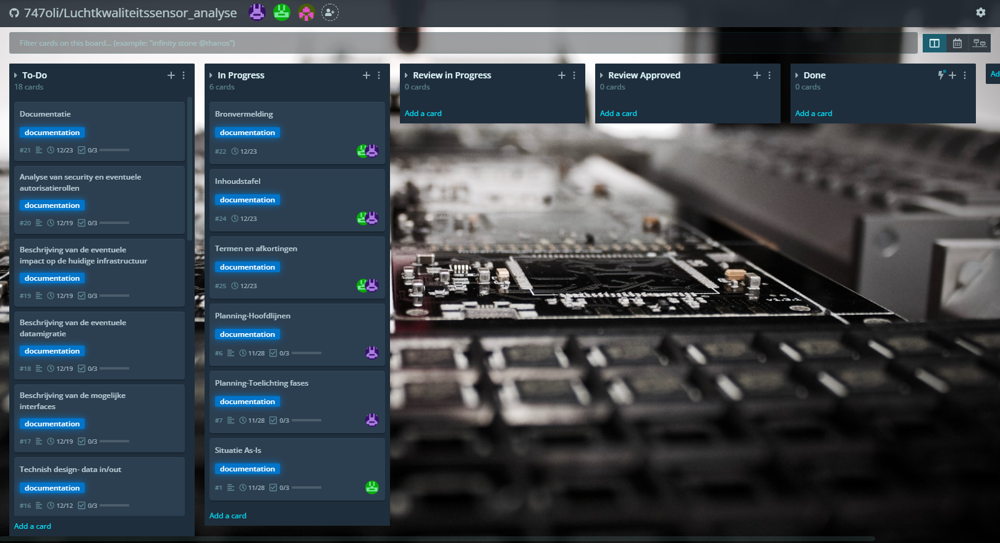
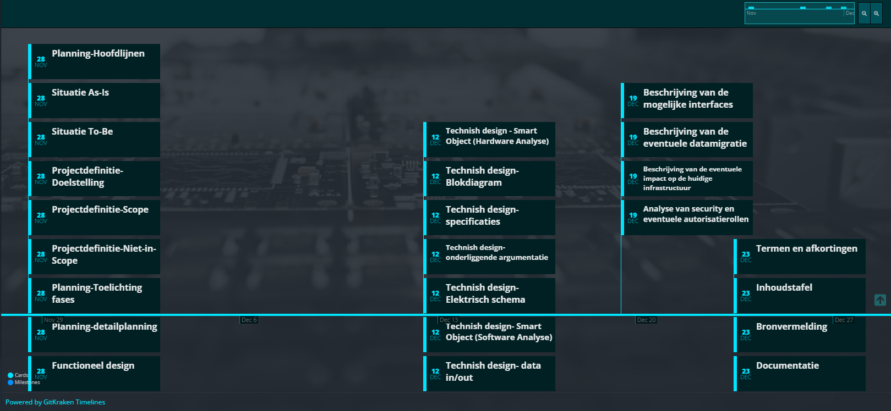

<h1>Blueprint Luchtkwaliteitssensor</h1>

<h2>AP Hogeschool Antwerpen</h2>

<h3>Gemaakt voor de haven van Antwerpen</h3>

    

        

            Begeleiders:
        

        <h4>
            Prof. Maarten Luyts
        </h4>
        <h4>
            Prof. Patrick Van Houtven
        </h4>
    

    

        <h4>
            Daan Dekoning Krekels
        </h4>
        <h4>
            Olivier Van Ransbeeck
        </h4>
        

            2ITIOT 
            Academiejaar 2021-2022
        

    

Inhoudstafel

[TOC]

# Versiebeheer

> [Het versiebeheer laat alle versies van het document zien met de daarbij horende wijzigingen. Denk eraan dat tijdelijke versies een nummer 0.x meekrijgen en dat de eerste finale versie het volgnummer 1.00 moet krijgen. De verspreiding is altijd naar personen, geen bedrijven.
> 
> Vergeet deze en andere cursief gedrukte sjabloontekst niet te verwijderen voor de document versies ≥ 1.0]

| Nr.  | Datum      | Verspreiding              | Status           | Wijziging                                                    |
| ---- | ---------- | ------------------------- | ---------------- | ------------------------------------------------------------ |
| 0.01 | 09/12/2021 | Prof. Patrick Van Houtven | Eerste verdeling | Alle toevoegingen, bezig aan Functioneel en Technisch Design |
|      |            |                           |                  |                                                              |

# Termen en Afkortingen

| Term            | Omschrijving                                                                                                                                                                   |
| --------------- | ------------------------------------------------------------------------------------------------------------------------------------------------------------------------------ |
| PoA             | Port of Antwerp; Haven van Antwerpen                                                                                                                                           |
| MCU             | Microcontroller                                                                                                                                                                |
| eCO2 | CO2-eq koolstofdioxide equivalent om het gas te kunnen vergelijken met ander ebroeikasgassen, de omrekening is gebaseerd op het Global Warming Potential (GWP). [2] |
| eTVOC           | Total concentration of Volatile Organic Compounds equivalent. De equivalente waarde van organische materialen in de lucht.                                                     |
| NOX  | Stikstofoxiden: de som van stikstofmonoxide (NO) en stikstofdioxide (NO2). [3]                                                                                      |
| I/O             | Input/Output: de ingangen en uitgangen van bijvoorbeeld een MCU.                                                                                                               |

# Opdrachtgever

> *[De opdrachtgevers van het project en hun rol in het project. Meneer Luyts blijkbaar]*

Er is een als maar groeiende vraag naar data over onze luchtkwaliteit daardoor heeft de Port of Antwerp een zeer grote interesse in de luchtkwaliteit in de haven. PoA verlangt ernaar om de luchtkwaliteit van de volledige haven in kaart te brengen. Dit willen zij doen door op een tiental locaties sensoren op te hangen die wij zullen voorzien. Er is een LoRaWAN beschikbaar waar de verschillende sensoren van gebruik moeten maken zodat ze op een zuinige manier hun sensordata kunnen doorgeven. 

# Samenvatting

>   *[Korte samenvatting van het project en context, 1 of 2 alinea’s]*
> 
> Nog is opnieuw bekijken! Aanpassingen voorstellen

Onze medestudenten van het 3de jaar elektronica-ICT bouwen momenteel een module om de luchtkwaliteit in de haven van Antwerpen te meten. Zij hebben verschillende sensoren gebruikt waarmee zij diverse luchtkwaliteitsparameters opslaan, verwerken en analyseren.

Wij zullen de efficiëntie, gebruiksvriendelijkheid en dataverwerkingscapaciteit verbeteren van deze module om op deze manier de huidige tekortkomingen weg te werken. 

Deze tekortkomingen kunnen als volgt voorgesteld worden:

- De hitte ontwikkeling in de module leidt tot foutieve temperatuurmetingen.

- De huidige module is alleen capabel tot korte afstandscommunicatie via wifi of door gebruik te maken van een SD-kaart.

- De maximale batterijduur bedraagt momenteel minder dan 1 maand.

- Buiten deze tekortkomingen zouden wij graag nog extra functionaliteiten toevoegen of verwijderen die als volgende punten kunnen samengevat worden:

- Het verminderen van het aantal onnodige temperatuurmeettoestellen.

- Het verwijderen van het OLED scherm om batterijduur te verhogen.

- Het verwijderen van de GPS aangezien dit statische apparaten zijn op vaste locaties.

- Het veranderen van de huidige ESP32 naar een energiezuiniger model.

- Het verminderen van het aantal software bibliotheken om de opslagcapaciteit te verhogen.

- Het voorstellen van de data op een gebruiksvriendelijke interface.

# Situatie As-Is

> *[De beschrijving van het huidig project of de huidige werkwijze en probleemstelling. Werkwijze kan ook manuele handelingen zijn. Wat bestaat er al en wat is de noodzaak tot de verandering]*

> *[TIP ! Dit kan m.b.v. diagrammen zoals activiteitsdiagrammen voor processen, BPMN, toestandsdiagrammen voor toestandsveranderingen, sequentiediagrammen… Kan ook blokdiagram zijn]*

### *Probleemstelling:*

> *[Beschrijven aan de hand van dit huidig proces. Wat zijn de problemen dat opgelost moeten worden*

Momenteel is het project, dankzij de studenten van het 3de jaar al redelijk ver gevorderd [1]. Hun doel was om een mobile sensor te maken zodat de studenten van chemie er metingen mee kunnen uitvoeren in en rondom Antwerpen. De module moet voor een langere tijd mobiel kunnen werken en in verbinding staan met een databank. De eerste prototypes zijn al afgeleverd en lijken te werken. De sensor moet beschikken over een communicatietechniek die weinig stroom verbruikt en een goot bereik heeft. De eerste prototypes van de sensor werken.

In figuur 1 is de mindmap van de sensor te zien. Je kan zien dat de hardware en software vereisten al zijn ingevuld. De basis zal bij ons grotendeels hetzelfde zijn. 

<figure>

<figcaption >Figuur 1: Mindmap</figcaption>
</figure>

In het hardware schema is uitgebreid weergegeven hoe de verschillende sensoren en componenten van de juiste spanning worden voorzien en hoe ze zullen communiceren met de gekozen ESP32 module. 

<figure>

<figcaption >Figuur 2: Hardware schema</figcaption>
</figure>

Er is gekozen voor een ESP32-WROVER omdat deze beschikt over genoeg opslag en I/O aansluitingen. Er is een kans dat er nog wordt overgeschakeld op de ATSAMD21G18A-AUT voor zijn low-power eigenschappen. De keuze van modules en sensoren is ook gemaakt met stroomverbruik in het achterhoofd. De sensoren en modules zijn in onderstaande tabel terug te vinden. 

| Naam                                             | Eigenschappen                                                                                                                                                                                                                                                                                                           | Argumentatie                                                                                                                                                                                                                                                                                                                                                                                             | Links                                                                                                                                                                                                                                                                                                                                                             |
| ------------------------------------------------ | ----------------------------------------------------------------------------------------------------------------------------------------------------------------------------------------------------------------------------------------------------------------------------------------------------------------------- | -------------------------------------------------------------------------------------------------------------------------------------------------------------------------------------------------------------------------------------------------------------------------------------------------------------------------------------------------------------------------------------------------------- | ----------------------------------------------------------------------------------------------------------------------------------------------------------------------------------------------------------------------------------------------------------------------------------------------------------------------------------------------------------------- |
| GY-NEO6MV2                                       | **GPS Module** Vcc = 3.3V-5V; Imax = 67mA; UART](https://en.wikipedia.org/wiki/Universal_asynchronous_receiver-transmitter) protocol 3.3V; Baudrate: 9600                Leessnelheid: 1Hz (1s)                                                                                                                         | De GPS module GY-NEO6MV2 is een zeer snelle, kleine en  compacte module om de locatie te bepalen. Het is makkelijk  implementeerbaar en makkelijk te coderen.                                                                                                                                                                                                                                            | [Winkel](https://www.tinytronics.nl/shop/nl/communicatie/gps/gy-neo6mv2-gps-module)             [Datasheet](https://www.u-blox.com/sites/default/files/products/documents/NEO-6_DataSheet_(GPS.G6-HW-09005).pdf)             [Bibliotheek](https://github.com/mikalhart/TinyGPSPlus)                                                                              |
| 0.96 inch OLED Display 128*64 pixels blauw - I2C | **OLED (Organic Light Emitting Diode)**                Vcc = 3.3V-5V; 128*64 pixels;             Kijkhoek van 160°; I²C module om pinnen te verminderen Andere soort ook met SPI of minder/meer pixels                                                                                                                  | Een OLED display is populair om zijn compactheid en  scherpheid. Het is ondersteund door elke MCU en maakt gebruik van de 2  meest voorkomende spanningsniveaus (3.3V en 5V). Om pinnen te besparen, is het makkelijk dat we de OLED kunnen aansturen via I²C. Daarnaast is de grootte en plaats van de letters & tekens is  vrij te kiezen. Deze   functionaliteit hebben we niet bij een LCD.          | [Winkel](https://www.tinytronics.nl/shop/nl/displays/oled/0.96-inch-oled-display-128*64-pixels-blauw-i2c)             [Datasheet](https://www.elecrow.com/download/SSD1306 Datasheet.pdf)             [Bibliotheek](https://github.com/olikraus/u8g2)                                                                                                             |
| RN2483A-I/RM104                                  | **RN2483A LoRa module** Vcc = 2.1V - 3.6V; Imax = 60 mA; Vermogen van +14.1 dBm met 38.9mA; ASCII Command Interface over UART, Payload length max 64 bytes; 5km bereik in urban en 15km in suburban area                                                                                                                | LoRa staat bekend om zijn low-power functionaliteiten en  zeer lange afstanden (10km en langer). Daarom gebruiken we deze module  om de data van al onze AQS nodes naar de server te krijgen. Daarnaast is deze module simpel aan te sturen dankzij de ASCII  commando's via UART interface en ook bruikbaar bij 5V IC's zoals Arduino Nano en Uno.                                                      | [Winkel](https://be.farnell.com/microchip/rn2483a-i-rm104/transceiver-module-300kbps-870mhz/dp/2920841)             [Datasheet](https://www.farnell.com/datasheets/2648020.pdf)             [Datasheet-Commands](https://ww1.microchip.com/downloads/en/DeviceDoc/40001784B.pdf)             [Bibliotheek](https://github.com/axelelettronica/sme-RN2483-library) |
| CCS811                                           | **Temperatuur, eCO en eTVOC2**                Vcc = 1.8V-3.3V; Imax = 54mA; [I²C](https://en.wikipedia.org/wiki/I²C) protocol 3.3V; Meetbereik temperatuur: -40°C ~ +85°C,Meetbereik luchtvochtigheid: 10% ~ 95% Meetbereik eCO²: 400ppm1 ~ 32768ppm; Meetbereik eTVOC: 0ppb5 ~ 29206ppb; Leessnelheid: 100kHz (0.01ms) | Een minder bekende sensor maar zeker wel bekend in IoT toepassingen. Het kan temperatuur, eCO² en eTVOC meten. Het heeft geen  opwarm tijd dus is direct bruikbaar en is ook een SMD component wat  zeker een voordeel is om het zo compact mogelijk te maken.                                                                                                                                           | [Winkel](https://www.tinytronics.nl/shop/nl/sensoren/ccs811-luchtkwaliteit-sensor)             [Datasheet](https://www.sciosense.com/wp-content/uploads/documents/SC-001232-DS-2-CCS811B-Datasheet-Revision-2.pdf)             [Bibliotheek](https://github.com/adafruit/Adafruit_CCS811)                                                                         |
| SDS011                                           | **Fijnstof** Vcc = 5V; Imax = 200mA                [UART](https://en.wikipedia.org/wiki/Universal_asynchronous_receiver-transmitter) protocol 3.3V; Baudrate: 9600                Meetbereik PM2.53 & PM104: 0μg/m3 ~ 999.9 μg/m3; Meetbereik luchtvochtigheid: 10% ~ 95% Leessnelheid: 1Hz (1s)                        | De SDS011 is een veel gebruikte fijnstof sensor voor  DIY-projecten. Het zal niet de nauwkeurigste zijn, maar het geeft toch  al een sterke indicatie van wat het fijnstof gehalte is in de lucht.  Daarnaast is het een goedkoop model. Het werkt met een ventilator die de lucht binnentrekt. Het zal  dus eerst moeten opgezet worden om de huidige lucht erin te trekken  vooraleer we kunnen meten. | [Winkel](https://www.tinytronics.nl/shop/nl/sensoren/nova-sds011-hoge-precisie-laser-stofsensor)             [Datasheet](https://cdn-reichelt.de/documents/datenblatt/X200/SDS011-DATASHEET.pdf)             [Bibliotheek](https://www.arduinolibraries.info/libraries/sds011-sensor-library)                                                                     |
| BME280                                           | **Temperatuur, Barometer & Luchtvochtigheid** Vcc = 3.3V                Imax = 4.5mA; [I²C](https://en.wikipedia.org/wiki/I²C) protocol 3.3V; Meetbereik temperatuur: -40°C ~ +85°C; Meetbereik luchtvochtigheid: 0% ~ 100%; Meetbereik luchtdruk: 300hPa ~ 1100hPa; Leessnelheid: 1Hz (1s)                             | Deze IC heeft een tal van metingen aan boord (temperatuur,  luchtvochtigheid en druk) en het is een SMD component, dus makkelijk  te integreren op een pcb.                                                                                                                                                                                                                                              | [Winkel](https://www.tinytronics.nl/shop/nl/sensoren/temperatuur-lucht-vochtigheid/ bme280-digitale-barometer-druk-en-vochtigheid-sensor-module)             [Datasheet](https://www.mouser.com/datasheet/2/783/BST-BME280_DS001-11-844833.pdf)             [Bibliotheek](https://github.com/adafruit/Adafruit_BME280_Library)                                    |
| MHZ19                                            | **CO²** Vcc = 4.9V - 5.1V; Imax = 125mA                [UART](https://en.wikipedia.org/wiki/Universal_asynchronous_receiver-transmitter) protocol 3.3V; Meetbereik: 400ppm ~ 2000ppm; opwarmtijd: ~1min; leessnelheid: 1Hz (1s)                                                                                         | Het is een sensor dat enkel en alleen is ontworpen om CO² te meten. Het zal dus zeer nauwkeurig zijn. Enkel heeft het een opwarmtijd nodig.                                                                                                                                                                                                                                                              | [Winkel](https://www.tinytronics.nl/shop/nl/sensoren/winsen-mh-z19c-co2-sensor-met-kabel)             [Datasheet](https://www.winsen-sensor.com/d/files/PDF/Infrared Gas Sensor/NDIR CO2 SENSOR/MH-Z19 CO2 Ver1.0.pdf)             [Bibliotheek](https://github.com/strange-v/MHZ19)                                                                              |

Momenteel worden volgende metingen gedaan: temperatuur, CO², eCO², eTVOC, fijnstof, luchtdruk, luchtvochtigheid. Nog niet alle metingen zijn accuraat genoeg, zo meet de temperatuursensor te hoge waardes omdat de microcontroller warmte ontwikkelt. Het toestel beschikt over een GPS module en een OLED scherm.

# Situatie To-Be

> *[Wat ga je juist maken? Indien je Agile werkt, kan je de Epics beschrijven, het Minimal Viable Product, … Leg duidelijk het verschil uit met de As-Is situatie door bv. het nieuwe proces uit te tekenen. Een activiteitsdiagram van To-Be kan beschrijven welk stuk er anders is dan in het activiteitsdiagram van de As-Is.]*

Onze opgave is een klein beetje anders dan die waar de derdejaars momenteel aan werken. Daarom zullen wij een aantal aspecten van de sensor anders aanpakken. Bij de opgave van vorig jaar was het doel om een mobiele sensor te hebben die in en rond Antwerpen de luchtkwaliteit kan meten. De uiteindelijke sensor was bedoeld voor studenten chemie. Onze opgave is om sensoren te maken die een vaste plaats krijgen en daar een hele tijd op batterij zullen moeten werken. 

Ons idee is om, omdat de locatie van de sensor vast staat, de GPS module te verwijderen. Dit kan ons ook voordelen opleveren op vlak van stroomgebruik. Het OLED display is voor ons project ook niet nodig dus die component zullen we ook laten vallen. Metingen die we nog moeten toevoegen is NOX (Stikstofoxiden). 

De communicatie via LoRaWAN is bij ons ook nog steeds een vereiste. 

Figuur 1 is onze mindmap die gebaseerd is op het ontwerp van de derdejaars. De grijze ballonnen zijn in ons project weggelaten, groene ballonnen zijn nieuw toegevoegd. Bij de metingen is Stikstofoxiden toegevoegd en er zijn verschillende modules weggehaald die we niet nodig hebben.

<figure>

<figcaption >Figuur 1: Mindmap</figcaption>
</figure>

Als microcontroller willen we ons focussen op de ATSAMD21G18A-AUT omdat deze een zeer laag stroomverbruik heeft. Het enige nadeel is dat het gebruik van deze MCU ingewikkelder is in vergelijking met de ESP32 die meer ondersteuning heeft. Indien de integratie van de haalbaar ATSAMD21G18A-AUT zou zijn,dan zou dit een zeer groot voordeel opleveren qua batterijleven. 

### Epics

Zoals eerder gezegd zullen we bij het project in het 2de semester met agile werken. Hieronder volgt een korte beschrijving van de verschillende epics waarin het project in onderverdeeld.

#### Componenten onderzoeken, testen en documenteren

Bij elk individuele component zullen we afzonderlijk moeten onderzoeken op welke manier we deze kunnen integreren. Dat wil zeggen dat we features van deze component moeten testen en de code en schakeling ervoor moeten ontwikkelen om deze te implementeren in ons project. Vervolgens moeten we uitvoerig testen of de werking ervan correct is. Tenslotte zullen we de implementatie documenteren.

#### Componenten toevoegen aan het project

Nadat de component getest en correct bevonden is, moeten we deze implementeren in ons project. Dit is natuurlijk een wederkerend proces voor elke nieuwe component. We bekijken de samenwerking van de componenten en lossen problemen op die voorkomen. Dit wordt gedaan een breadbord of dergelijke.

#### PCB ontwikkelen

Pas wanneer, bij de vorige stap, het gehele project aan onze eisen voldoet, zullen we een PCB maken van de huidige staat van het project. Opnieuw zullen we verschillende testen ondernemen om een correcte werking te garanderen. De PCB's zullen dan besteld worden wat redelijk wat tijd in beslag zal nemen.

#### UI software onderzoeken en testen

Nadat we zeker zijn dat alle componenten correct werken in ons project zullen we de User Interface ontwikkelen die de waardes van ons project op een visuele manier voorstellen. Deze wordt aangepast wanneer er nieuwe componenten toegevoegd worden aan het project.

#### Ontwikkeling case

De case is een zeer belangrijk deel van ons project omdat het de integriteit van onze schakeling waarborgt. Bij elke nieuwe PCB moeten we kijken of onze huidige case nog voldoet aan de vereisten en zo niet updaten en opnieuw printen.

#### Live testen project

Tenslotte zullen we ter plaatste ons project meerdere keren moeten uittesten om te zien of het correct werkt.

### MVP

Een stationaire sensor met behuizing voor buiten gebruik waarin onderstaande metingen gebeuren:

- Omgevingstemperatuur

- Luchtvochtigheid

- Luchtdruk

- CO²/eCO²

- TVOC/eTVOC

- Fijnstof

- Stikstofoxiden

Deze metingen worden via het LoRaWAN netwerk van de Antwerpse haven opgestuurd en weergegeven worden op een UI. 

## Projectdefinitie

### Doelstelling

> *[Uitschrijven van de doelstellingen van het voorgestelde project]*

### Scope

> - *[Opsommen van de functionaliteit en onderdelen dit bij het uitvoeren van het project horen. Probeer dit zo sluitend mogelijk te doen, dit voorkomt discussies.]*
> 
> - *Maak assumpties indien nodig.*
> 
> - *[TIP ! Gebruik use case diagram en use case scenario’s]*
> 
> - Geef mee waaraan het aan moet voldoen en niet het component exact

#### Luchtkwaliteitssensor

##### Onderdelen

- CCS81: Temperatuur, eCO2 en TVOC

- SDS011: Fijnstof

- BME280: Temperatuur, luchtdruk en luchtvochtigheid

- Batterij: Voltage

- MHZ19: CO²

- RN483A-I/RM104: LoRa

- xxxx: NOx

- ATSAMD21G18A-AUT: MCU

##### Functionaliteiten

- Op interval doorsturen van metingen naar een server via een LoRaWAN netwerk.

- Batterijduur van meer dan 1 maand.

- Externe temperatuur meten.

- Externe CO² waardes meten.

- Externe TVOC waardes meten.

- Externe fijnstof waardes meten.

- Externe luchtdruk waardes meten.

- Externe luchtvochtigheid waardes meten.

- Externe stikstofoxiden waardes meten.

- Het intern batterij voltage weergeven.

- Capaciteit om terug te vallen op SD-opslag bij mislukte verzending via LoRa.

- Het lezen van waardes via de seriële monitor voor test doeleinden.

<figure>

<figcaption >Figuur 2 : Dataflow Diagram Situation-to-be</figcaption>
</figure>

#### Luchtkwaliteit monitoring dashboard

##### Onderdelen

- NodeRed: Opensource visuele tool voor het verbinden van hardware devices voor IoT.

- Grafana: visueel voorstellen van gegevens in grafieken.

- InfluxDB: database voor het opslaan van gegevens voor real-time applicaties in IoT.

##### Functionaliteiten

- Gegevens van server omzetten in grafieken

- Het weergeven van grafieken op een internet dashboard.

- De positie weergeven van de sensor op een kaart op het dashboard.

<figure>

<figcaption >Figuur 3 : Use Case Situation-to-be</figcaption>
</figure>

### Niet in Scope

> - *[Expliciet vernoemen wat niet tot de draagwijdte (scope) van het project hoort, bv. het aanleveren van onderdelen,  opleiding, maintenance, onderhoud van servers, … Wat gaan we niet realisere.

#### Een zelf ontwikkeld dashboard

De LORAPayload gaat door NodeRed in een database geplaatst worden. De Database wordt influx-DB. Vanuit deze data gaan Grafana onze gegevens ophalen om de visualisaties te doen. Het dashboard zal qua design dus niet in huis ontwikkeld worden.

#### LoRaWAN netwerk opzetten

We zullen het LoRaWAN netwerk van de haven gebruiken om onze data te communiceren naar de server. Het opzetten en onderhouden van het LoRaWAN netwerk ligt niet binnen onze scope.

#### Onderhoud en updates vanaf 2023

Vanaf 2023 zullen het onderhoud en de updates van zowel het dashboard als de luchtkwaliteitssensor niet meer door ons gedaan worden.

# Planning

> *[Agile of Waterfall? Scrum of Kanban?* *Wekelijkse sprints of per maand? Hoe omgaan met stories die niet goedgekeurd zijn op demo? Welke tools om alles op te volgen? We hebben nog 6 weken ofzo. Gaat over de analyse. Kaban zit in github]*

We gebruiken een kaban board in GitKraken om onze planning bij te houden. Dit board is ook gesyncroniseerd met "GitHub issues" waardoor we een beter overzicht krijgen van onze afgewerkte en nog af te werken onderdelen.

In het kaban board zijn de mogelijke statussen van de individuele delen zichtbaar als kolommen om elk deel apart te kunnen opvolgen.  De mogelijkheden zijn de volgende:

- To do

- In progress

- Review in progress

- Review approved

- Done

Het project bestaat uit 2 fase's: de pré-review en de review fase. De eerste 2 statussen (To do en In progress) worden door ons aan elk onderdeel toegekend tijdens de pré-review fase. Hierna  geven wij de controle van dat deel over onze begeleiders tijdens de Review fase. Zij zullen deze onderdelen vervolgens beoordelen en feedback doorsturen naar ons waarop wij terug aanpassingen zullen maken.

Elk individueel onderdeel bevat 3 taken: Raw, Semi-Raw en Polished. Deze taken tonen ons de staat van het onderdeel vóór de review fase's zoals hierboven uitgelegd. Hierdoor hebben wij een overzicht over de vooruitgang van elk onderdeel  in ons project.

Onze methodologie voor de gehele analyse is Waterfall omdat we met een strak tijdschema rekening moeten houden en elk deel van analyse apart in zijn volledigheid afgewerkt kan worden zonder dat het invloed heeft op de andere delen van het project.

<figure>

<figcaption >Figuur x: Kaban Dashboard</figcaption>
</figure>

## Hoofdlijnen

> *[Korte beschrijving van de planning met de grootste deadlines.]*

De planning werkt met wekelijkse of 2-wekelijkse deadlines. Hierbij wordt er een volledige "Polished" versie van bepaalde onderdelen verwacht. De planning houdt niet rekening met de andere taken zoals Raw en Semi-Raw. Er wordt verwacht dat deze taken afzonderlijk afgewerkt worden voor de "Polished" versie doorgestuurd wordt.

Zoals reeds eerder gezegd wordt onze planning door het kaban board in GitKraken bij gehouden, onder "Detailplanning" kan u ons volledig tijdsschema terugvinden.

De algemene deadline voor het project staat op 23/12/2021.    

<figure>

<figcaption >Figuur x: Kaban Timeline</figcaption>
</figure>

## Toelichting fases

> *[Indien de planning in fases of iteraties verloopt, bespreek dan kort hoe deze opgebouwd zijn.]*

Er zijn geen fase's voor het gehele project, alleen voor de individuele onderdelen.

## Detailplanning

> - *[TIP ! Kan een Gantt Chart zijn of een tabel.] Milestones*

# Functioneel design

> - [*Beschrijf hier wat er in het ontwerp reeds opgenomen worden m.b.t. functionaliteit, bv. alle schermen moeten volgens de huisstijl opgebouwd zijn, verduidelijkingen van business rules en beslissingen. Wat is de algemene lay-out, welke automatische acties moeten er achter je knoppen/processen zitten?]*
> - *[TIP ! Denk aan wireframes,mock-ups, toestandsdiagrammen, beslissingstabellen, activitydiagrammen.]*

In onderstaande diagram is de abstracte architectuur van ons ontwerp te zien. Deze diagram toont onze luchtkwaliteitssensor als draadloos apparaat dat verbonden is met een *gateway* of toegangspunt. Uiteraard is het de bedoeling dat er meerdere verschillende luchtkwaliteitssensoren verbonden zijn met een gateway. De gateway geeft de ontvangen informatie door aan de *data verwerking*, die zal op zijn beurt de de informatie verwerken en op de juiste manier in onze *database* opslaan. Gebruikers kunnen het dashboard raadplegen met visualisaties van de gebeurde metingen. Het dashboard haalt deze gegevens rechtstreeks uit de database. 

<figure>

<figcaption >Figuur x: Abstracte Architectuur</figcaption>
</figure>

# Technisch design

> - *[Geen code maar algemene **architectuur** (vb. Database-Firewall-Applicatieserver), gebruikte technologieën en configuratie]*
> 
> - *[TIP ! Denk aan klassediagrammen, sequentiediagrammen, beslissingstabellen, toestandsdiagrammen.]*

## [**Smart Object (Hardware Analyse)**](https://luytsm.github.io/iot-cursus/#/deliverables/analyse?id=smart-object-hardware-analyse)

> IoT is een hardware project. De focus ligt op het ontwikkelen van een fysiek object.  Een Smart Object kan beschreven worden aan de hand van de 4 volgende criteria.
> 
> 1. Monitoring
> 2. Controle
> 3. Optimalisatie
> 4. Autonomie
> 
> De criteria zijn geordend volgens stijgende complexiteit. Monitoring is eenvoudiger dan een object volledig autonoom te maken. Hierdoor kan je de criteria ook gebruiken als leidraad doorheen het iteratief proces dat we gebruiken in IoT. Als je prototype ontwikkelt zorg er eerst voor dat het al data kan verzamelen vooraleer dat het volledig autonoom is.
> 
> Aan de hand van bovenstaand criteria wordt er een of meerdere Smart Objects gedefinieerd die een oplossing biedt voor de probleemstelling in het project.
> 
> Beschrijf in dit deel de nodige Smart Objects voor jullie project. Naast de beschrijving voorzie ook het volgende:
> 
> - Blokdiagram
> - Specificaties
> - Argumentatie
> - Elektrisch schema
> 
> Hieronder kan je een voorbeeld vinden van elk diagram.

### [Blokdiagram](https://luytsm.github.io/iot-cursus/#/deliverables/analyse?id=blokdiagram)

> In het blokdiagram deel je het hardware probleem op in grote delen en kan je zien hoe ze met elkaar gelinkt zijn.

De data van de MCU wordt verstuurd via 3 protocollen: UART, I²C en SPI.
Aangezien verschillende modules met dezelfde aansluitingen verbonden zijn, zullen we elke module een ander adres geven om te zorgen dat de data de juiste module bereikt.

De batterij levert een voltage van 7.4V aan. Deze is natuurlijk te hoog voor onze componenten waardoor we 2 lineaire serie regelaars nodig hebben om het voltage te verlagen. We verlagen de 7.4V naar zowel 5V als 3.3V. We sturen vervolgens de verschillende voltages uit naar de juiste modules.

<figure>

<figcaption >Figuur x: Blokdiagram</figcaption>
</figure>

### [Specificaties](https://luytsm.github.io/iot-cursus/#/deliverables/analyse?id=specificaties)

> Voor elke blok in het blokdiagram van een Smart Object stel je de specificaties en/of elektrische karakteristieken op. Deze worden in het volgende formaat meegeven in de analyse.

| **Blok**                                 | **Specificatie**    | **Min** | **Nominaal** | **Max**          |
| ---------------------------------------- | ------------------- | ------- | ------------ | ---------------- |
| **ATSAMD21G18A-AUT**                     | Werkspanning        | 1.62V   | 3.3V         | 3.8V             |
|                                          | Frequentie CPU      | -       | 48mHz        | -                |
|                                          | Stroomverbruik      | 1.17mA  | 3.37mA       | 6.32mA           |
|                                          | Stroomlimiet        | -       | -            | 92mA             |
| **RN2483A-I/RM104**                      | Werkspanning        | 2.1V    | 3.3V         | 3.6V             |
|                                          | Stroomverbruik      | 1.6µA   | 2.8mA        | 38.9mA           |
|                                          | Stroomlimiet        | -       | -            | 200mA (25mA/pin) |
| **Li-Po 2 Cell**                         | Totale werkspanning | 6.0V    | 7.4V         | 8.2V             |
|                                          | Capaciteit          | -       | 2400mAh      | -                |
| **LD1117**                               | Werkspanning        | 1.2V    | -            | 15V              |
| **CCS811**                               | Werkspanning        | 1.8V    | 3.3V         | 3.3V             |
|                                          | Stroomverbruik      | 19µA    | 26mA         | -                |
|                                          | Stroomlimiet        | -       | -            | 54mA             |
| **SDS011**                               | Werkspanning        | 4.7V    | 5V           | 5.3V             |
|                                          | Stroomverbruik      | <4mA    | 70mA         | 80mA             |
|                                          | Stroomlimiet        | -       | -            | 200mA            |
| **BME280**                               | Werkspanning        | 1.7V    | 3.3V         | 3.6V             |
|                                          | Stroomverbruik      | 0.1µA   | 3.6µA        | 630µA            |
|                                          | Stroomlimiet        | -       | -            | 4.5mA            |
| **MH-Z19**                               | Werkspanning        | 4.9V    | 5V           | 5.5V             |
|                                          | Stroomverbruik      | -       | <18mA        | -                |
|                                          | Stroomlimiet        | -       | -            | 125mA            |
| **SparkFun microSD Transflash breakout** | Werkspanning        | 2.8V    | 3.3V         | 3.6V             |
| **SGP41-D-R4**                           | Werkspanning        | 1.7V    | 3.3V         | 3.6V             |
|                                          | Stroomverbruik      | 34µA    | 3.2mA        | 4.6mA            |
|                                          | Stroomlimiet        | -       | -            | 100mA            |

### [Onderliggende ](https://luytsm.github.io/iot-cursus/#/deliverables/analyse?id=onderliggende-argumentatie)argumentatie

> Voor elk blok van het blokdiagram moet je ook een argumentatie geven waarom deze gebruikt wordt in de voorgestelde oplossing in de analyse. Geef ook mogelijke alternatieven. Geef deze informatie in het volgend formaat:

| **Blok**          | Component                            | **Argumentatie**                                                                                                                                                                                                                                                         | **Alternatieven**                               |
| ----------------- | ------------------------------------ | ------------------------------------------------------------------------------------------------------------------------------------------------------------------------------------------------------------------------------------------------------------------------ | ----------------------------------------------- |
| CPU               | ATSAMD21G18A-AUT                     | De grootste troef van de SAMD21 is dat het een zeer zuinige chip is. De SAMD21 verbruikt maximaal 6.32mA, de ESP32 daarentegen kan tot wel 500mA verbruiken. De MCU is krachtig en heeft zeer veel I/O pinnen. De bootloader moeten we initieel zelf nog branden.        | ESP32 WROVER                                    |
| Batterij          | Li-Po 2 Cell                         | De Li-Po batterij heeft een goede capaciteit en zeer lange levensspan. Voorts is haar relatief gewicht laag t.o.v. haar volume. Ze is veel flexibeler dan een lithium-ion batterij. Tenslotte is ze beschikbaar in ons school.                                           | Lithium-ion batterij                            |
| Voltage converter | LD1117                               | De LD1117 heeft het exacte bereik dat we nodig hebben. We kunnen van onze 7.4V batterij spanning naar 3.3V en 5V converteren.                                                                                                                                            | MIC5219-3.3YM5-TR, MIC5219-5.0YM5-TR            |
| MicroSD-Lezer     | SparkFun microSD Transflash breakout | We hebben gekozen voor de SparkFun kaartlezen omdat we deze zeker beschikbaar hebben op school. Deze module is zeer klein dus dat komt goed van pas.                                                                                                                     | Eender welke Arduino compatibele microSD-Lezer. |
| Temperatuur       | BME280                               | Deze sensor is een bekende en goed ondersteunde sensor die makkelijk op de pcb te integreren is. Ze heeft verschillende metingen aan boord waardoor het een kost-effectieve IC is. Het bereik is perfect voor de temperaturen in België.                                 | LM35, DHT22                                     |
| Luchtdruk         | BME280                               | Deze sensor is een bekende en goed ondersteunde sensor die makkelijk op de pcb te integreren is. Ze heeft verschillende metingen aan boord waardoor het een kost-effectieve IC is.                                                                                       | MPX4115A                                        |
| Luchtvochtigheid  | BME280                               | Deze sensor is een bekende en goed ondersteunde sensor die makkelijk op de pcb te integreren is. Ze heeft verschillende metingen aan boord waardoor het een kost-effectieve IC is.                                                                                       | DHT22                                           |
| CO²               | MH-Z19                               | De positieve zaken van deze sensor zijn de volgende:  Non-Dispersief InfraRood-licht waardoor ze zeer zuinig is, goede kalibratie out-of-the-box en makkelijk leesbaar uit een seriële poort via UART.                                                                   | MQ-135, Adafruit SGP30                          |
| eCO²              | CCS811                               | Deze TVOC, eCO² en CO² sensor is heel zuinig waardoor het de batterijduur verbetert. Voorts is het een goede sensor met redelijk accurate waarden.                                                                                                                       | Adafruit SGP30                                  |
| TVOC              | CCS811                               | Deze TVOC, eCO² en CO² sensor is heel zuinig waardoor het de batterijduur verbetert. Voorts is het een goede sensor met redelijk accurate waarden.                                                                                                                       | Adafruit SGP30                                  |
| Fijnstof          | SDS011                               | De SDS011 is een bekende sensor die gespecialiseerd is in het meten van fijnstof. Ze heeft een goede prijs versus nauwkeurigheid.                                                                                                                                        | PPD42NS                                         |
| LoRA              | RN2483A-I/RM104                      | We gebruiken deze module om data van onze luchtkwaliteitssensor naar de online database te sturen over het LoRaWAN netwerk van de haven.  De module is redelijk goed ondersteunt en is niet moeilijk om aan te sturen. Ook is ze perfect combineerbaar met de de SAMD21. | MKL62BA                                         |
| NOx               | SGP41-D-R4                           | De prijskwaliteitsverhouding is zeer goed bij deze sensor die zowel NOx en VOC meet. Gespecialiseerde NOx sensoren zijn zeer duur en zou de projectkosten doen verdubbelen.                                                                                              |                                                 |

### [Elektrisch schema](https://luytsm.github.io/iot-cursus/#/deliverables/analyse?id=elektrisch-schema)

Onderstaand elektrisch schema is grotendeels gebaseerd op het schema van de derdejaars. De GPS module is weggehaald, de NOx sensor SGP41 is toegevoegd en de ESP32 MCU is vervangen door de ATSAMD21 die we zullen gebruiken.  

<figure>

<figcaption >Figuur x: Elektrisch schema</figcaption>
</figure>

## [**Smart Object (Software Analyse)**](https://luytsm.github.io/iot-cursus/#/deliverables/analyse?id=smart-object-hardware-analyse)

> Om software /datamigratie te analyseren is een top down methodologie aangeraden. Eerst moeten de datastromen vastgelegd worden.  Als bepaalt is welke data er in en uit een specifieke blok van het systeem komt, moet eveneens het formaat bepaald worden waarin dit gebeurt. Om dit succesvol te doen moet er ook rekening gehouden worden met de hardware restricties. Bv. JSON versturen over I²C met een Arduino is gedoemd om te falen.
> 
> Het aangeven van welke data eer specifiek in een bepaald blok ingaat of uitkomt geef je weer met volgend format:

### [Data in / Out](https://luytsm.github.io/iot-cursus/#/deliverables/analyse?id=data-in-out)

| **Blok**                             | **Data In**                                                                                                                                                                                                             | Data Uit                                                                                                                           |
| ------------------------------------ | ----------------------------------------------------------------------------------------------------------------------------------------------------------------------------------------------------------------------- | ---------------------------------------------------------------------------------------------------------------------------------- |
| ATSAMD21G18A-AUT                     | [LoRa payload, Seed nummer, temperatuur, luchtvochtigheid, druk, TVOC, P10, P25, CO2, NOx, BATVal],  [LoRa payload], BATVal, TVOC, P25, P10, Temperatuur, luchtdruk, luchtvochtigheid, CO², data opgslagen signaal, NOx | Wake-up signalen, sleep signalen, seed aanvraag, data formateer aanvraag, data verstuur aanvraag, connect signalen, setup signalen |
| RN2483A-I/RM104                      | Connect signaal, sleep signaal, data formateer aanvraag, data verstuur aanvraag                                                                                                                                         | [LoRa payload, Seed nummer, temperatuur, luchtvochtigheid, druk, TVOC, P10, P25, CO2, NOx, BATValue] en [LoRa payload]             |
| Li-Po 2 Cell                         | -                                                                                                                                                                                                                       | BATvalue                                                                                                                           |
| LD1117                               | 7.4V                                                                                                                                                                                                                    | 3.3V en 5V                                                                                                                         |
| CCS811                               | Setup signaal, wake-up signaal, sleep signaal, data aanvraag                                                                                                                                                            | TVOC waarde                                                                                                                        |
| SDS011                               | Setup signaal, wake-up signaal, sleep signaal, data aanvraag                                                                                                                                                            | P25 en P10 waarden                                                                                                                 |
| BME280                               | Setup signaal, wake-up signaal, sleep signaal, data aanvraag                                                                                                                                                            | Temperatuur, luchtdruk en luchtvochtigheidswaarden                                                                                 |
| MH-Z19                               | Setup signaal, connect signaal, sleep signaal, data aanvraag                                                                                                                                                            | CO² waarde                                                                                                                         |
| SparkFun microSD Transflash breakout | LoraFormat data, data verstuur signaal                                                                                                                                                                                  | Data opgeslagen signaal                                                                                                            |
| SGP41-D-R4                           | Wake-up Signaal, sleep signaal, data aanvraag                                                                                                                                                                           | NOx waarde                                                                                                                         |

### Statediagram

Maak een statediagram van je voorgestelde oplossing. Alle menu’s en alle veranderingen met hun impact.  Hieronder vind je een voorbeeld:

### Flowchart

> Het wisselen van de verschillende states beschrijf je best in flowchart. Maak voor elke transistion een flowchart.

#### ATSAMD21G18A-AUT

<figure>

<figcaption >Figuur x: Flow Chart ATSAMD</figcaption>
</figure>

#### **RN2483A-I/RM104**

<figure>

<figcaption >Figuur x: Flow Chart RN2483A-I/RM104</figcaption>
</figure>

#### **Li-Po 2 Cell**

<figure>

<figcaption >Figuur x: Flow Chart  Li-Po 2 Cell</figcaption>
</figure>

#### **CCS811**

<figure>

<figcaption >Figuur x: Flow Chart CCS811</figcaption>
</figure>

#### **SDS011**

#### **BME280**

<figure>

<figcaption >Figuur x: Flow Chart BME280</figcaption>
</figure>

#### **MH-Z19**

#### **SparkFun microSD Transflash breakout**

#### SGP41-D-R4

#### Generate Seed

# Beschrijving van de mogelijke interfaces

> - *[Beschrijf de mogelijke interfaces van je project en hoe de communicatie gebeurt.]*
> 
> - *[TIP ! Gebruik een context DFD om te verduidelijken en zoek nog eens op wat een context DFD ook al weer is.]*
> 
> - Als er een grafische interface nodig, dienen hiervoor mock ups gemaakt worden, moeten nog geen kunstwerken zijn.

- 

# Beschrijving van eventuele datamigratie

> - *[Beschrijf de aanpak van de datamigratie en hoe de scripts opgebouwd zijn.]*
> 
> - *[TIP ! Je kan hiervoor ERD gebruiken, activiteitsdiagrammen.]*

# Beschrijving van eventuele impact op de huidige infrastructuur

> - *[Beschrijf de impact op de infrastructuur. Dienen er servers aangekocht te worden,geherinstalleerd, of gewijzigd te worden? Worden er andere systemen in het landschap voorzien of verwijderd?]*
> 
> - *[TIP ! Gebruik component- of deploymentdiagram.]*

# Analyse van security en eventuele autorisatierollen

> - *[Beschrijf de methode en aanpak van de security. Als het om een extern systeem gaat, leg dan uit hoe zij het aanpakken. Kan het gehackt worden?]*
> 
> - *BCP*
> 
> - *Privacy*
> 
> - *[Beschrijf de verschillende autorisatierollen en wat ze net kunnen in het systeem]*

# Documentatie

> - *[Hoe wordt documentatie in de code voorzien?]*
> 
> - *[Zal er documentatie voorzien worden als het project opgeleverd wordt, bv. handleidingen?]*

# Bronvermelding

> [Vermeld hier al je bronnen volgens de APA stijlgids (https://apastyle.apa.org/). Denk eraan dat elk brontype (website/rapport/wetenschappelijk artikel/hoofdstuk uit boek/…) zijn eigen stijl heeft. ]

| Nummer | APA-brondvermelding                                                                                                                                                                                            |
| ------ | -------------------------------------------------------------------------------------------------------------------------------------------------------------------------------------------------------------- |
| [1]    | Elsermans, R., Kramp, T., & Jongenelen, B. (2021). *AirQualitySensor*. Geraadpleegd op 25 november 2021, van https://ap-it-gh.github.io/ssys21-docs-luchtsensor/#/                                             |
| [2]    | Centraal Bureau voor de Statistiek. (2020, 6 mei). CO2-equivalent. Geraadpleegd op 3 december 2021, van https://www.cbs.nl/nl-nl/nieuws/2020/19/uitstoot-broeikasgassen-3-procent-lager-in-2019/co2-equivalent |
| [3]    | Het Rijksinstituut voor Volksgezondheid en Milieu. (z.d.). Stikstof - Stikstofoxiden (NOₓ). RIVM. Geraadpleegd op 3 december 2021, van https://www.rivm.nl/stikstof/stikstofoxiden-nox                         |
| Nummer | APA-brondvermelding                                                                                                                                                                                            |
