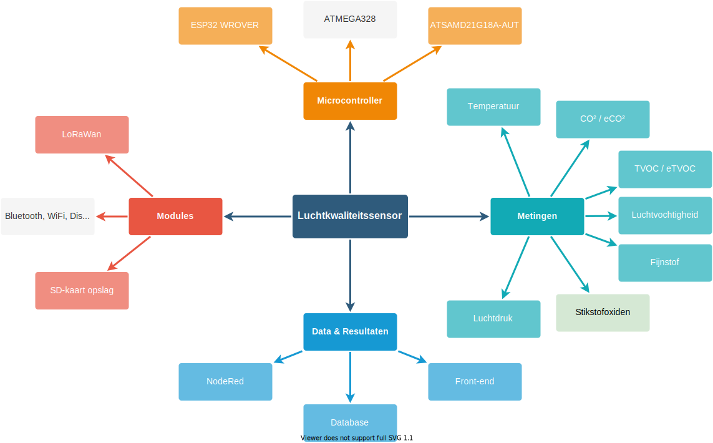
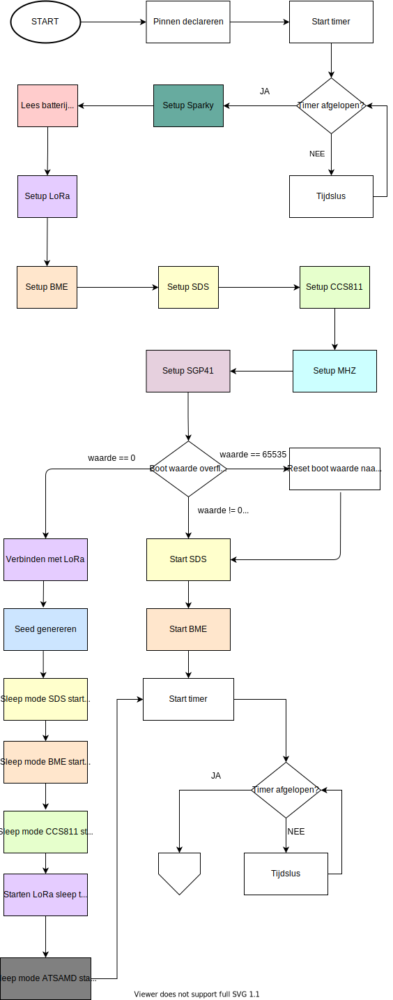
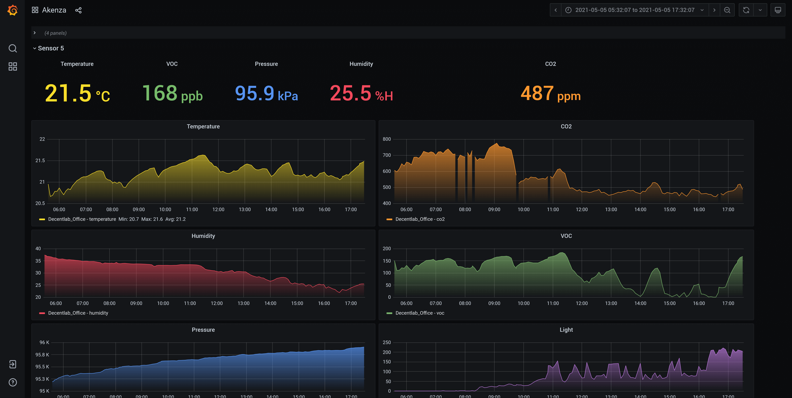
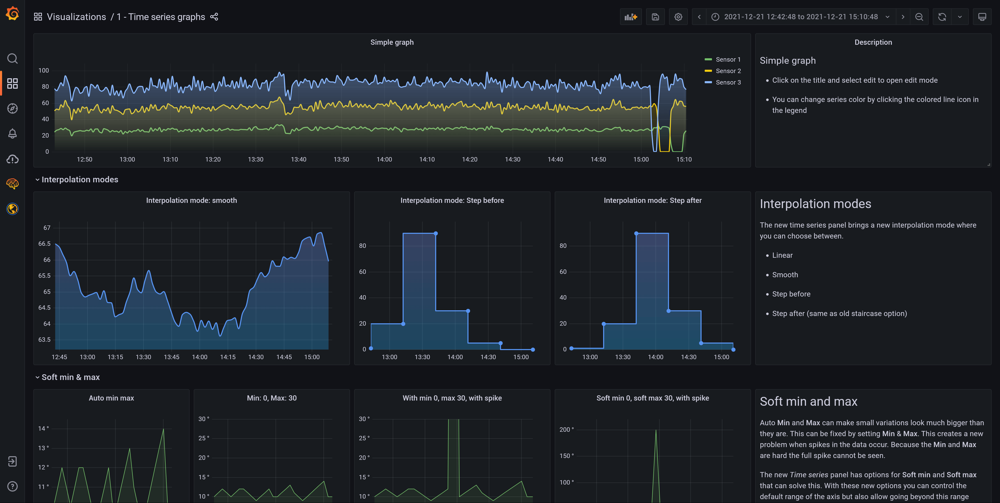

<h1>Blueprint Luchtkwaliteitssensor</h1>

<h2>AP Hogeschool Antwerpen</h2>

<h3>Gemaakt voor de haven van Antwerpen</h3>

    

        

            Begeleiders:
        

        <h4>
            Maarten Luyts
        </h4>
        <h4>
            Patrick Van Houtven
        </h4>
    

    

        

            Gemaakt door:
        

        <h4>
            Daan Dekoning Krekels
        </h4>
        <h4>
            Olivier Van Ransbeeck
        </h4>
        

            2ITIOT 
            Academiejaar 2021-2022
        

    

Inhoudstafel

[TOC]

# Versiebeheer

> [Het versiebeheer laat alle versies van het document zien met de daarbij horende wijzigingen. Denk eraan dat tijdelijke versies een nummer 0.x meekrijgen en dat de eerste finale versie het volgnummer 1.00 moet krijgen. De verspreiding is altijd naar personen, geen bedrijven.
> 
> Vergeet deze en andere cursief gedrukte sjabloontekst niet te verwijderen voor de document versies ≥ 1.0]

| Nr.  | Datum      | Verspreiding              | Status           | Wijziging                                                    |
| ---- | ---------- | ------------------------- | ---------------- | ------------------------------------------------------------ |
| 0.01 | 09/12/2021 | Prof. Patrick Van Houtven | Eerste verdeling | Alle toevoegingen, bezig aan Functioneel en Technisch Design |
|      |            |                           |                  |                                                              |

# Termen en Afkortingen

| Term            | Omschrijving                                                                                                                                                                   |
| --------------- | ------------------------------------------------------------------------------------------------------------------------------------------------------------------------------ |
| PoA             | Port of Antwerp; Haven van Antwerpen                                                                                                                                           |
| MCU             | Microcontroller                                                                                                                                                                |
| eCO2 | CO2-eq koolstofdioxide equivalent om het gas te kunnen vergelijken met ander ebroeikasgassen, de omrekening is gebaseerd op het Global Warming Potential (GWP). [2] |
| eTVOC           | Total concentration of Volatile Organic Compounds equivalent. De equivalente waarde van organische materialen in de lucht.                                                     |
| NOX  | Stikstofoxiden: de som van stikstofmonoxide (NO) en stikstofdioxide (NO2). [3]                                                                                      |
| I/O             | Input/Output: de ingangen en uitgangen van bijvoorbeeld een MCU.                                                                                                               |

# Opdrachtgever

> *[De opdrachtgevers van het project en hun rol in het project. Meneer Luyts blijkbaar]*

Er is een als maar groeiende vraag naar data over onze luchtkwaliteit daardoor heeft de Port of Antwerp een zeer grote interesse in de luchtkwaliteit in de haven. PoA verlangt ernaar om de luchtkwaliteit van de volledige haven in kaart te brengen. Dit zal gedaan worden door op een tiental locaties sensoren op te hangen. Er is een LoRaWAN beschikbaar waar de verschillende sensoren van gebruik moeten maken zodat ze op een zuinige manier hun sensordata kunnen doorgeven. 

# Samenvatting

>   *[Korte samenvatting van het project en context, 1 of 2 alinea’s]*
> 
> Nog is opnieuw bekijken! Aanpassingen voorstellen

De studenten van het 3de jaar elektronica-ICT bouwen momenteel een module om de luchtkwaliteit in de haven van Antwerpen te meten. Zij hebben verschillende sensoren gebruikt waarmee zij diverse luchtkwaliteitsparameters opslaan, verwerken en analyseren.

Wij zullen de efficiëntie, gebruiksvriendelijkheid en dataverwerkingscapaciteit verbeteren van deze module om op deze manier de huidige tekortkomingen weg te werken. 

Deze tekortkomingen kunnen als volgt voorgesteld worden:

- De hitte ontwikkeling in de module leidt tot foutieve temperatuurmetingen.

- De huidige module is alleen capabel tot korte afstandscommunicatie via wifi of door gebruik te maken van een SD-kaart.

- De maximale batterijduur bedraagt momenteel minder dan 1 maand.

Buiten deze tekortkomingen zouden wij graag nog extra functionaliteiten toevoegen of verwijderen die als volgende punten kunnen samengevat worden:

- Het verminderen van het aantal onnodige temperatuurmeettoestellen.

- Het verwijderen van het OLED scherm om batterijduur te verhogen.

- Het verwijderen van de GPS aangezien dit statische apparaten zijn op vaste locaties.

- Het veranderen van de huidige ESP32 naar een energiezuiniger model.

- Het verminderen van het aantal software bibliotheken om de opslagcapaciteit te verhogen.

- Het voorstellen van de data op een gebruiksvriendelijke interface.

# Probleemstelling

De haven van Antwerpen vindt dat de sensor langdurig op batterij moet kunnen werken. Dit omdat de sensoren op locaties zullen hangen waar er geen stroomvoorziening voor handen is. Voorts is er een vraag gekomen om NOx'n te meten in de lucht om zo te kunnen onderzoeken of er schadelijke stoffen aanwezig zijn. 

Tenslotte is er de vereiste gekomen om de data op een andere manier te communiceren. In plaats van de huidige manier van het manueel vergaren van de data via een SD kaart moet deze draadloos doorgestuurd kunnen worden. Hierbij komende dat wifi of bluetooth zal hiervoor niet beschikbaar zijn door de locatie van de sensoren.

# Situatie As-Is

> *[De beschrijving van het huidig project of de huidige werkwijze en probleemstelling. Werkwijze kan ook manuele handelingen zijn. Wat bestaat er al en wat is de noodzaak tot de verandering]*

> *[TIP ! Dit kan m.b.v. diagrammen zoals activiteitsdiagrammen voor processen, BPMN, toestandsdiagrammen voor toestandsveranderingen, sequentiediagrammen… Kan ook blokdiagram zijn]*

Momenteel is het project al redelijk ver gevorderd [1]. Het vorige doel was om een mobiele sensor te maken zodat de studenten van chemie er metingen mee kunnen uitvoeren in en rondom Antwerpen. De module moet voor een langere tijd mobiel kunnen werken, zijn positie weergeven op een kaart en in verbinding staan met een databank. De sensor moest beschikken over een communicatietechniek die weinig stroom verbruikt en een groot bereik heeft. De eerste prototypes zijn al afgeleverd en lijken te werken.

In figuur 1 is de mindmap van de huidige staat van de sensor te zien. Je kan zien dat de hardware en software vereisten al zijn ingevuld. De basis zal tijdens dit project grotendeels hetzelfde zijn. 

<figure>

<figcaption >Figuur 1: Mindmap</figcaption>
</figure>

Vervolgens hebben we het huidig hardware schema. Hierin is uitgebreid weergegeven hoe de verschillende sensoren en componenten van de juiste spanning worden voorzien en hoe ze momenteel communiceren met de ESP32 module. 

<figure>

<figcaption >Figuur 2: Hardware schema</figcaption>
</figure>

Er was destijds gekozen voor een ESP32-WROVER omdat deze beschikte over genoeg opslag en I/O aansluitingen. Deze werd beter ondersteund ondanks dat hij meer stroom verbruikte in vergelijking met de ATSAMD21G18A-AUT die bekend staat voor zijn low-power eigenschappen. Echter was de implementatie van de ATSAMD21 moeilijk en werd deze dan in die fase van het project niet gebruikt. 

Wel is er bij de keuze van modules en sensoren wel rekening gehouden met met stroomverbruik. De huidige sensoren en modules zijn in onderstaande tabel terug te vinden. 

| Naam                                             | Argumentatie                                                                                                                                                                                                                                                                                                                                                                                             |
| ------------------------------------------------ | -------------------------------------------------------------------------------------------------------------------------------------------------------------------------------------------------------------------------------------------------------------------------------------------------------------------------------------------------------------------------------------------------------- |
| GY-NEO6MV2                                       | De GPS module GY-NEO6MV2 is een zeer snelle, kleine en  compacte module om de locatie te bepalen. Het is makkelijk  implementeerbaar en makkelijk te coderen.                                                                                                                                                                                                                                            |
| 0.96 inch OLED Display 128*64 pixels blauw - I2C | Een OLED display is populair om zijn compactheid en  scherpheid. Het is ondersteund door elke MCU en maakt gebruik van de 2  meest voorkomende spanningsniveaus (3.3V en 5V). Om pinnen te besparen, is het makkelijk dat we de OLED kunnen aansturen via I²C. Daarnaast is de grootte en plaats van de letters & tekens is  vrij te kiezen. Deze   functionaliteit hebben we niet bij een LCD.          |
| RN2483A-I/RM104                                  | LoRa staat bekend om zijn low-power functionaliteiten en  zeer lange afstanden (10km en langer). Daarom gebruiken we deze module  om de data van al onze AQS nodes naar de server te krijgen. Daarnaast is deze module simpel aan te sturen dankzij de ASCII  commando's via UART interface en ook bruikbaar bij 5V IC's zoals Arduino Nano en Uno.                                                      |
| CCS811                                           | Een minder bekende sensor maar zeker wel bekend in IoT toepassingen. Het kan temperatuur, eCO² en eTVOC meten. Het heeft geen  opwarm tijd dus is direct bruikbaar en is ook een SMD component wat  zeker een voordeel is om het zo compact mogelijk te maken.                                                                                                                                           |
| SDS011                                           | De SDS011 is een veel gebruikte fijnstof sensor voor  DIY-projecten. Het zal niet de nauwkeurigste zijn, maar het geeft toch  al een sterke indicatie van wat het fijnstof gehalte is in de lucht.  Daarnaast is het een goedkoop model. Het werkt met een ventilator die de lucht binnentrekt. Het zal  dus eerst moeten opgezet worden om de huidige lucht erin te trekken  vooraleer we kunnen meten. |
| BME280                                           | Deze IC heeft een tal van metingen aan boord (temperatuur,  luchtvochtigheid en druk) en het is een SMD component, dus makkelijk  te integreren op een pcb.                                                                                                                                                                                                                                              |
| MHZ19                                            | Het is een sensor dat enkel en alleen is ontworpen om CO² te meten. Het zal dus zeer nauwkeurig zijn. Enkel heeft het een opwarmtijd nodig.                                                                                                                                                                                                                                                              |

Momenteel worden volgende metingen gedaan: temperatuur, CO², eCO², eTVOC, fijnstof, luchtdruk, luchtvochtigheid. Echt zijn nog niet alle metingen accuraat genoeg, zo meet de temperatuursensor te hoge waardes omdat de microcontroller warmte ontwikkelt. Het toestel beschikt over een GPS module en een OLED scherm.

# Situatie To-Be

> *[Wat ga je juist maken? Indien je Agile werkt, kan je de Epics beschrijven, het Minimal Viable Product, … Leg duidelijk het verschil uit met de As-Is situatie door bv. het nieuwe proces uit te tekenen. Een activiteitsdiagram van To-Be kan beschrijven welk stuk er anders is dan in het activiteitsdiagram van de As-Is.]*

De functionele vereisten van de luchtkwaliteitssensor zijn sinds dit jaar aangepast. Daarom zullen er ook een aantal aspecten van de sensor moeten veranderen. 

Terwijl er vorig jaar de noodzaak was om een mobiele sensor te hebben die in en rond Antwerpen de luchtkwaliteit kon meten, is dit nu niet meer het geval. Er is nu de vraag gekomen om sensoren te maken die hetzelfde meten maar een vaste plaats zullen krijgen en daar voor een lange periode op batterij moeten kunnen werken. 

Daarom zal de GPS module verwijderd worden aangezien het niet nodig is om live locatie informatie te krijgen. Dit zal voordelen opleveren op vlak van een verminderd stroomgebruik. 

Voorts is het OLED display niet meer noodzakelijk door de draadloze communicatie dus zal ook die component verwijderd worden. Ook hierbij zal er een verminderd stroomverbruik zijn. 

Hiernaast is er de eis gekomen om stikstofoxiden te meten. Hiervoor zullen wij een interne sensor voorzien die in onze huidige architectuur zal passen. 

De communicatie via LoRaWAN is heden ook nog steeds een vereiste. 

Tenslotte zal er de overstap gemaakt worden naar de ATSAMD21G18A-AUT als microcontroller omdat deze een zeer laag stroomverbruik heeft. Zoals eerder gezegd heeft die wel als nadeel dat het gebruik van deze MCU ingewikkelder is in vergelijking met de ESP32 die meer ondersteuning heeft.

Onderstaande figuur toont een mindmap van de huidige staat waarop de veranderingen die zullen gebeuren te vinden zijn. De grijze ballonnen zijn de componenten die weggelaten worden en groene ballonnen degene die toegevoegd worden.

<figure>

<figcaption >Figuur 1: Mindmap</figcaption>
</figure>

## Projectdefinitie

### Doelstelling

> *[Uitschrijven van de doelstellingen van het voorgestelde project]*

### Scope

> - *[Opsommen van de functionaliteit en onderdelen dit bij het uitvoeren van het project horen. Probeer dit zo sluitend mogelijk te doen, dit voorkomt discussies.]*
> 
> - *Maak assumpties indien nodig.*
> 
> - *[TIP ! Gebruik use case diagram en use case scenario’s]*
> 
> - Geef mee waaraan het aan moet voldoen en niet het component exact

#### Vereiste functionaliteiten luchtkwaliteitssensor

- Op interval doorsturen van metingen naar een server via een LoRaWAN netwerk.

- Batterijduur van meer dan 1 maand.

- Externe temperatuur meten.

- Externe CO² waardes meten.

- Externe TVOC waardes meten.

- Externe fijnstof waardes meten.

- Externe luchtdruk waardes meten.

- Externe luchtvochtigheid waardes meten.

- Externe stikstofoxiden waardes meten.

- Het intern batterij voltage weergeven.

- De capaciteit hebben om terug te vallen op SD-opslag bij mislukte verzending via LoRa.

- Het lezen van waardes via de seriële monitor voor test doeleinden.

#### Vereiste functionaliteiten monitoring dashboard

- Gegevens van de server omzetten in grafieken

- Het weergeven van grafieken op een internet dashboard.

- De positie weergeven van de sensor op een kaart op het dashboard (zonder live data van de locatie).

### Niet in Scope

> *[Expliciet vernoemen wat niet tot de draagwijdte (scope) van het project hoort, bv. het aanleveren van onderdelen,  opleiding, maintenance, onderhoud van servers, … Wat gaan we niet realiseren.

#### Een zelf ontwikkeld dashboard

De LORAPayload gaat door NodeRed in een database geplaatst worden. De Database wordt influx-DB. Vanuit deze data gaat Grafana de gegevens ophalen om de visualisaties te doen. Het dashboard zal qua design dus niet binnenshuis ontwikkeld worden.

#### LoRaWAN netwerk opzetten

Het LoRaWAN netwerk van de haven zal gebruikt worden om de data te communiceren naar de server. Het opzetten en onderhouden van het LoRaWAN netwerk ligt niet binnen de scope.

#### Onderhoud en updates vanaf 2023

Vanaf 2023 zal het onderhoud en de updates van zowel het dashboard als de luchtkwaliteitssensor niet meer gewaarborgd worden.

#### Minimum Viable Product

Een stationaire sensor met behuizing voor buiten gebruik waarin onderstaande metingen gebeuren:

- Omgevingstemperatuur

- Luchtvochtigheid

- Luchtdruk

- CO²/eCO²

- TVOC/eTVOC

- Fijnstof

- Stikstofoxiden

Deze metingen worden via het LoRaWAN netwerk van de Antwerpse haven opgestuurd en weergegeven worden op een UI.

# Planning

> *[Agile of Waterfall? Scrum of Kanban?* *Wekelijkse sprints of per maand? Hoe omgaan met stories die niet goedgekeurd zijn op demo? Welke tools om alles op te volgen? We hebben nog 6 weken ofzo. Gaat over de analyse. Kaban zit in github]*

Er zal een kaban board in GitKraken gebruikt worden om de planning bij te houden. Dit board is ook gesynchroniseerd met "GitHub issues" waardoor men een beter overzicht zal krijgen van de afgewerkte en nog af te werken onderdelen.

In het kaban board zijn de mogelijke statussen van de individuele delen zichtbaar als kolommen om elk deel apart te kunnen opvolgen.  De mogelijkheden zijn de volgende:

- To do

- In progress

- Review in progress

- Review approved

- Done

Tijdens het project worden er 2 fases gehanteerd voor het maken van updates: de pré-review en de review fase. De eerste 2 statussen (To do en In progress) worden door het team aan elk onderdeel toegekend tijdens de pré-review fase. Hierna wordt de controle van dat deel over gegeven aan de begeleiders tijdens de Review fase. Zij zullen deze updates vervolgens beoordelen en feedback terugsturen waarop er terug aanpassingen zullen gemaakt worden.

De methodologie die voor het project zal gebruikt worden is agile. We zullen constant nieuwe updates doen bij elke module om de luchtkwaliteitssensor efficiënter en beter te maken. 

<figure>

<figcaption >Figuur x: Kaban Dashboard</figcaption>
</figure>

## Hoofdlijnen

> *[Korte beschrijving van de planning met de grootste deadlines.]*

De planning werkt met wekelijkse of 2-wekelijkse deadlines. 

Zoals reeds eerder gezegd wordt onze planning door het kaban board in GitKraken bij gehouden, onder "Detailplanning" kan u ons volledig tijdsschema terugvinden.

## Epics

> *[Indien de planning in fases of iteraties verloopt, bespreek dan kort hoe deze opgebouwd zijn.]*

Zoals eerder gezegd zal er tijdens dit project met agile gewerkt worden. Hieronder volgt een korte beschrijving van de verschillende epics waarin het project zal onderverdeeld zijn.

#### Componenten onderzoeken, testen en documenteren

Bij elk individuele component zal er afzonderlijk onderzocht moeten worden op welke manier deze te integreren valt. Dat wil zeggen dat de features van deze component getest zullen worden en vervolgens de code en schakeling ervoor ontwikkelt zal worden om deze te implementeren in het project. Vervolgens moet er uitvoerig getest worden om de correcte werking te garanderen. Tenslotte zal de implementatie ervan gedocumenteerd worden.

#### Componenten toevoegen aan het project

Nadat de component getest is en correct bevonden is, moet deze geïmplementeerd worden in het project. Dit is natuurlijk een wederkerend proces voor elke nieuwe component. De samenwerking van de componenten wordt bekeken en voorkomende problemen zullen opgelost worden. Dit wordt hoogstwaarschijnlijk gedaan een breadbord.

#### PCB ontwikkelen

Pas wanneer, bij de vorige stap, het gehele project aan de eisen voldoet, zal er een PCB gemaakt worden van de huidige staat van het project. Opnieuw zullen er verschillende testen plaats vinden om een correcte werking ervan te garanderen. De PCB's zullen dan besteld worden wat redelijk wat tijd in beslag zal nemen.

#### UI software onderzoeken en testen

Nadat er zekerheid is dat alle componenten correct werken zal de User Interface ontwikkeld worden die de gemeten waardes van de sensoren op een visuele manier kan voorstellen. Deze wordt aangepast wanneer er nieuwe componenten toegevoegd worden aan het project.

#### Ontwikkeling case

De case is een zeer belangrijk deel van ons project omdat het de integriteit van onze schakeling waarborgt. Bij elke nieuwe PCB moet er gekeken worden of de huidige case nog voldoet aan de vereisten en zo niet moet deze opnieuw geüpdatet en geprint worden.

#### Live testen project

Tenslotte zal het project meerdere keren in de haven van Antwerpen worden uitgetest om te zien of de werking correct is.

## Detailplanning

> - *[TIP ! Kan een Gantt Chart zijn of een tabel.] Milestones*

<figure>

<figcaption >Figuur x: Kaban Timeline</figcaption>
</figure>

# Functioneel design

> - [*Beschrijf hier wat er in het ontwerp reeds opgenomen worden m.b.t. functionaliteit, bv. alle schermen moeten volgens de huisstijl opgebouwd zijn, verduidelijkingen van business rules en beslissingen. Wat is de algemene lay-out, welke automatische acties moeten er achter je knoppen/processen zitten?]*
> - *[TIP ! Denk aan wireframes,mock-ups, toestandsdiagrammen, beslissingstabellen, activitydiagrammen.]*

In onderstaande diagram is de abstracte architectuur van het toekomstige ontwerp te zien. Deze diagram toont de luchtkwaliteitssensor als draadloos apparaat dat verbonden is met een *gateway* of toegangspunt. Uiteraard is het de bedoeling dat er meerdere verschillende luchtkwaliteitssensoren verbonden zijn met een gateway. 

De gateway geeft de ontvangen informatie door aan de *data verwerking*, die zal op zijn beurt de informatie verwerken en op de juiste manier in onze *database* opslaan. Gebruikers kunnen het dashboard raadplegen met visualisaties van de gebeurde metingen. Het dashboard haalt deze gegevens rechtstreeks uit de database. 

<figure>

<figcaption >Figuur x: Abstracte Architectuur</figcaption>
</figure>

# Technisch design

> - *[Geen code maar algemene **architectuur** (vb. Database-Firewall-Applicatieserver), gebruikte technologieën en configuratie]*
> 
> - *[TIP ! Denk aan klassediagrammen, sequentiediagrammen, beslissingstabellen, toestandsdiagrammen.]*

## [**Smart Object (Hardware Analyse)**](https://luytsm.github.io/iot-cursus/#/deliverables/analyse?id=smart-object-hardware-analyse)

> IoT is een hardware project. De focus ligt op het ontwikkelen van een fysiek object.  Een Smart Object kan beschreven worden aan de hand van de 4 volgende criteria.
> 
> 1. Monitoring
> 2. Controle
> 3. Optimalisatie
> 4. Autonomie
> 
> De criteria zijn geordend volgens stijgende complexiteit. Monitoring is eenvoudiger dan een object volledig autonoom te maken. Hierdoor kan je de criteria ook gebruiken als leidraad doorheen het iteratief proces dat we gebruiken in IoT. Als je prototype ontwikkelt zorg er eerst voor dat het al data kan verzamelen vooraleer dat het volledig autonoom is.
> 
> Aan de hand van bovenstaand criteria wordt er een of meerdere Smart Objects gedefinieerd die een oplossing biedt voor de probleemstelling in het project.
> 
> Beschrijf in dit deel de nodige Smart Objects voor jullie project. Naast de beschrijving voorzie ook het volgende:
> 
> - Blokdiagram
> - Specificaties
> - Argumentatie
> - Elektrisch schema
> 
> Hieronder kan je een voorbeeld vinden van elk diagram.

## Samenvatting componenten

- CCS81: Temperatuur, eCO2 en TVOC

- SDS011: Fijnstof

- BME280: Temperatuur, luchtdruk en luchtvochtigheid

- Batterij: Voltage

- MHZ19: CO²

- RN483A-I/RM104: LoRa

- SGP41-D-R4: NOx

- ATSAMD21G18A-AUT: MCU

- SparkFun microSD Transflash breakout: SD-kaart

### [Blokdiagram](https://luytsm.github.io/iot-cursus/#/deliverables/analyse?id=blokdiagram)

> In het blokdiagram deel je het hardware probleem op in grote delen en kan je zien hoe ze met elkaar gelinkt zijn.

De data van de MCU wordt verstuurd via 3 protocollen: UART, I²C en SPI.
Aangezien verschillende modules met dezelfde aansluitingen verbonden zijn, zal elke module een ander adres krijgen om te zorgen dat de data de juiste module bereikt.

De batterij levert een voltage van 7.4V aan. Deze is natuurlijk te hoog voor onze componenten waardoor er 2 lineaire serie regelaars nodig zijn om het voltage te verlagen. Het verlaagt de 7.4V naar zowel 5V als 3.3V. Vervolgens worden de verschillende voltages naar de juiste modules uitgestuurd.

<figure>

<figcaption >Figuur x: Blokdiagram</figcaption>
</figure>

### [Specificaties](https://luytsm.github.io/iot-cursus/#/deliverables/analyse?id=specificaties)

> Voor elke blok in het blokdiagram van een Smart Object stel je de specificaties en/of elektrische karakteristieken op. Deze worden in het volgende formaat meegeven in de analyse.

| **Blok**                                 | **Specificatie**    | **Min** | **Nominaal** | **Max**          |
| ---------------------------------------- | ------------------- | ------- | ------------ | ---------------- |
| **ATSAMD21G18A-AUT**                     | Werkspanning        | 1.62V   | 3.3V         | 3.8V             |
|                                          | Frequentie CPU      | -       | 48mHz        | -                |
|                                          | Stroomverbruik      | 1.17mA  | 3.37mA       | 6.32mA           |
|                                          | Stroomlimiet        | -       | -            | 92mA             |
| **RN2483A-I/RM104**                      | Werkspanning        | 2.1V    | 3.3V         | 3.6V             |
|                                          | Stroomverbruik      | 1.6µA   | 2.8mA        | 38.9mA           |
|                                          | Stroomlimiet        | -       | -            | 200mA (25mA/pin) |
| **Li-Po 2 Cell**                         | Totale werkspanning | 6.0V    | 7.4V         | 8.2V             |
|                                          | Capaciteit          | -       | 2400mAh      | -                |
| **LD1117**                               | Werkspanning        | 1.2V    | -            | 15V              |
| **CCS811**                               | Werkspanning        | 1.8V    | 3.3V         | 3.3V             |
|                                          | Stroomverbruik      | 19µA    | 26mA         | -                |
|                                          | Stroomlimiet        | -       | -            | 54mA             |
| **SDS011**                               | Werkspanning        | 4.7V    | 5V           | 5.3V             |
|                                          | Stroomverbruik      | <4mA    | 70mA         | 80mA             |
|                                          | Stroomlimiet        | -       | -            | 200mA            |
| **BME280**                               | Werkspanning        | 1.7V    | 3.3V         | 3.6V             |
|                                          | Stroomverbruik      | 0.1µA   | 3.6µA        | 630µA            |
|                                          | Stroomlimiet        | -       | -            | 4.5mA            |
| **MH-Z19**                               | Werkspanning        | 4.9V    | 5V           | 5.5V             |
|                                          | Stroomverbruik      | -       | <18mA        | -                |
|                                          | Stroomlimiet        | -       | -            | 125mA            |
| **SparkFun microSD Transflash breakout** | Werkspanning        | 2.8V    | 3.3V         | 3.6V             |
| **SGP41-D-R4**                           | Werkspanning        | 1.7V    | 3.3V         | 3.6V             |
|                                          | Stroomverbruik      | 34µA    | 3.2mA        | 4.6mA            |
|                                          | Stroomlimiet        | -       | -            | 100mA            |

### [Onderliggende ](https://luytsm.github.io/iot-cursus/#/deliverables/analyse?id=onderliggende-argumentatie)argumentatie

> Voor elk blok van het blokdiagram moet je ook een argumentatie geven waarom deze gebruikt wordt in de voorgestelde oplossing in de analyse. Geef ook mogelijke alternatieven. Geef deze informatie in het volgend formaat:

| **Blok**          | Component                            | **Argumentatie**                                             | Links                                                        | **Alternatieven**                               |
| ----------------- | ------------------------------------ | ------------------------------------------------------------ | ------------------------------------------------------------ | ----------------------------------------------- |
| CPU               | ATSAMD21G18A-AUT                     | De grootste troef van de SAMD21 is dat het een zeer zuinige chip is. De SAMD21 verbruikt maximaal 6.32mA, de ESP32 daarentegen kan tot wel 500mA verbruiken. De MCU is krachtig en heeft zeer veel I/O pinnen. De bootloader moeten we initieel zelf nog branden. | [Winkel](https://www.mouser.be/ProductDetail/Microchip-Technology-Atmel/ATSAMD21G18A-AUT?qs=KLFHFgXTQiBkLYobE%2Fq9Qw==&gclid=CjwKCAiAh_GNBhAHEiwAjOh3ZHG8WOdRiM5K4oojQNa1EaOKMm-MsoXjzRuqgLk8DAMAHz1NB0ujaBoCesEQAvD_BwE) [Datasheet](https://www.mouser.be/datasheet/2/268/SAM_D21_DA1_Family_Data_Sheet_DS40001882H-2580554.pdf) | ESP32 WROVER                                    |
| Batterij          | Li-Po 2 Cell                         | De Li-Po batterij heeft een goede capaciteit en zeer lange levensspan. Voorts is haar relatief gewicht laag t.o.v. haar volume. Ze is veel flexibeler dan een lithium-ion batterij. Tenslotte is ze beschikbaar in ons school. | [Winkel](https://www.conrad.be/p/conrad-energy-lipo-accupack-74-v-2400-mah-aantal-cellen-2-20-c-softcase-xt60-1344133?WT.srch=1&gclid=CjwKCAiAh_GNBhAHEiwAjOh3ZODyQpj1PCOdHiGXfnYxeG0l__VZOiLFqiP5MSZwps0pyi__jmN_WhoC9LsQAvD_BwE&gclsrc=aw.ds&insert=8J&t=1&tid=13894944235_122657379817_pla-301443522443_pla-1344133&utm_campaign=shopping-feed&utm_content=free-google-shopping-clicks&utm_medium=surfaces&utm_source=google&utm_term=1344133&vat=true) [Datasheet](https://asset.conrad.com/media10/add/160267/c1/-/en/001344133SD01/veiligheidsvoorschriften-1344133-conrad-energy-lipo-accupack-74-v-2400-mah-aantal-cellen-2-20-c-softcase-xt60.pdf) | Lithium-ion batterij                            |
| Voltage converter | LD1117                               | De LD1117 heeft het exacte bereik dat we nodig hebben. We kunnen van onze 7.4V batterij spanning naar 3.3V en 5V converteren. | [Winkel](https://www.conrad.be/p/stmicroelectronics-ld1117av33-spanningsregelaar-lineair-to-220ab-positief-vast-1-a-1184973?searchTerm=LD1117&searchType=suggest&searchSuggest=product) [Datasheet](https://asset.conrad.com/media10/add/160267/c1/-/en/001184973DS01/datablad-1184973-stmicroelectronics-ld1117av33-spanningsregelaar-lineair-to-220ab-positief-vast-1-a.pdf) | MIC5219-3.3YM5-TR, MIC5219-5.0YM5-TR            |
| MicroSD-Lezer     | SparkFun microSD Transflash breakout | We hebben gekozen voor de SparkFun kaartlezen omdat we deze zeker beschikbaar hebben op school. Deze module is zeer klein dus dat komt goed van pas. | [Winkel](https://www.sparkfun.com/products/544) [Datasheet](https://www.sparkfun.com/datasheets/Prototyping/microSD_Socket.pdf) [Bibliotheek](https://github.com/arduino-libraries/SD) | Eender welke Arduino compatibele microSD-Lezer. |
| Temperatuur       | BME280                               | Deze sensor is een bekende en goed ondersteunde sensor die makkelijk op de pcb te integreren is. Ze heeft verschillende metingen aan boord waardoor het een kost-effectieve IC is. Het bereik is perfect voor de temperaturen in België. | [Winkel](https://www.tinytronics.nl/shop/nl/sensoren/temperatuur-lucht-vochtigheid/ bme280-digitale-barometer-druk-en-vochtigheid-sensor-module) [Datasheet](https://www.mouser.com/datasheet/2/783/BST-BME280_DS001-11-844833.pdf) [Bibliotheek](https://github.com/adafruit/Adafruit_BME280_Library) | LM35, DHT22                                     |
| Luchtdruk         | BME280                               | Deze sensor is een bekende en goed ondersteunde sensor die makkelijk op de pcb te integreren is. Ze heeft verschillende metingen aan boord waardoor het een kost-effectieve IC is. | [Winkel](https://www.tinytronics.nl/shop/nl/sensoren/temperatuur-lucht-vochtigheid/ bme280-digitale-barometer-druk-en-vochtigheid-sensor-module) [Datasheet](https://www.mouser.com/datasheet/2/783/BST-BME280_DS001-11-844833.pdf) [Bibliotheek](https://github.com/adafruit/Adafruit_BME280_Library) | MPX4115A                                        |
| Luchtvochtigheid  | BME280                               | Deze sensor is een bekende en goed ondersteunde sensor die makkelijk op de pcb te integreren is. Ze heeft verschillende metingen aan boord waardoor het een kost-effectieve IC is. | [Winkel](https://www.tinytronics.nl/shop/nl/sensoren/temperatuur-lucht-vochtigheid/ bme280-digitale-barometer-druk-en-vochtigheid-sensor-module) [Datasheet](https://www.mouser.com/datasheet/2/783/BST-BME280_DS001-11-844833.pdf) [Bibliotheek](https://github.com/adafruit/Adafruit_BME280_Library) | DHT22                                           |
| CO²               | MH-Z19                               | De positieve zaken van deze sensor zijn de volgende:  Non-Dispersief InfraRood-licht waardoor ze zeer zuinig is, goede kalibratie out-of-the-box en makkelijk leesbaar uit een seriële poort via UART. | [Winkel](https://www.tinytronics.nl/shop/nl/sensoren/winsen-mh-z19c-co2-sensor-met-kabel) [Datasheet](https://www.winsen-sensor.com/d/files/PDF/Infrared Gas Sensor/NDIR CO2 SENSOR/MH-Z19 CO2 Ver1.0.pdf) [Bibliotheek](https://github.com/strange-v/MHZ19) | MQ-135, Adafruit SGP30                          |
| eCO²              | CCS811                               | Deze TVOC, eCO² en CO² sensor is heel zuinig waardoor het de batterijduur verbetert. Voorts is het een goede sensor met redelijk accurate waarden. | [Winkel](https://www.tinytronics.nl/shop/nl/sensoren/ccs811-luchtkwaliteit-sensor) [Datasheet](https://www.sciosense.com/wp-content/uploads/documents/SC-001232-DS-2-CCS811B-Datasheet-Revision-2.pdf) [Bibliotheek](https://github.com/adafruit/Adafruit_CCS811) | Adafruit SGP30                                  |
| TVOC              | CCS811                               | Deze TVOC, eCO² en CO² sensor is heel zuinig waardoor het de batterijduur verbetert. Voorts is het een goede sensor met redelijk accurate waarden. | [Winkel](https://www.tinytronics.nl/shop/nl/sensoren/ccs811-luchtkwaliteit-sensor) [Datasheet](https://www.sciosense.com/wp-content/uploads/documents/SC-001232-DS-2-CCS811B-Datasheet-Revision-2.pdf) [Bibliotheek](https://github.com/adafruit/Adafruit_CCS811) | Adafruit SGP30                                  |
| Fijnstof          | SDS011                               | De SDS011 is een bekende sensor die gespecialiseerd is in het meten van fijnstof. Ze heeft een goede prijs versus nauwkeurigheid. | [Winkel](https://www.tinytronics.nl/shop/nl/sensoren/nova-sds011-hoge-precisie-laser-stofsensor) [Datasheet](https://cdn-reichelt.de/documents/datenblatt/X200/SDS011-DATASHEET.pdf) [Bibliotheek](https://www.arduinolibraries.info/libraries/sds011-sensor-library) | PPD42NS                                         |
| LoRA              | RN2483A-I/RM104                      | We gebruiken deze module om data van onze luchtkwaliteitssensor naar de online database te sturen over het LoRaWAN netwerk van de haven.  De module is redelijk goed ondersteunt en is niet moeilijk om aan te sturen. Ook is ze perfect combineerbaar met de de SAMD21. | [Winkel](https://be.farnell.com/microchip/rn2483a-i-rm104/transceiver-module-300kbps-870mhz/dp/2920841) [Datasheet](https://www.farnell.com/datasheets/2648020.pdf) [Datasheet-Commands](https://ww1.microchip.com/downloads/en/DeviceDoc/40001784B.pdf) [Bibliotheek](https://github.com/axelelettronica/sme-RN2483-library) | MKL62BA                                         |
| NOx               | SGP41-D-R4                           | De prijskwaliteitsverhouding is zeer goed bij deze sensor die zowel NOx en VOC meet. Gespecialiseerde NOx sensoren zijn zeer duur en zou de projectkosten doen verdubbelen. | [Winkel](https://www.soselectronic.com/products/sensirion/sgp41-sgp41-d-r4-359695) [Datasheet](https://cdn.sos.sk/productdata/3c/28/3146f64d/sgp41-sgp41-d-r4.pdf) [Bibliotheek](https://github.com/Sensirion/arduino-i2c-sgp41) | Industrial Nitric Oxide (NO) Sensor             |

#### [Elektrisch schema](https://luytsm.github.io/iot-cursus/#/deliverables/analyse?id=elektrisch-schema)

Onderstaand elektrisch schema is grotendeels gebaseerd op het schema van de huidige toestand van het project. De GPS module is echter weggehaald, het OLED scherm is verwijdert, de NOx sensor SGP41 is toegevoegd en de ESP32 MCU is vervangen door de ATSAMD21 zal gebruikt worden.  

<figure>

<figcaption >Figuur x: Elektrisch schema</figcaption>
</figure>

## [**Smart Object (Software Analyse)**](https://luytsm.github.io/iot-cursus/#/deliverables/analyse?id=smart-object-hardware-analyse)

> Om software /datamigratie te analyseren is een top down methodologie aangeraden. Eerst moeten de datastromen vastgelegd worden.  Als bepaalt is welke data er in en uit een specifieke blok van het systeem komt, moet eveneens het formaat bepaald worden waarin dit gebeurt. Om dit succesvol te doen moet er ook rekening gehouden worden met de hardware restricties. Bv. JSON versturen over I²C met een Arduino is gedoemd om te falen.
> 
> Het aangeven van welke data eer specifiek in een bepaald blok ingaat of uitkomt geef je weer met volgend format:

### [Data in / Out](https://luytsm.github.io/iot-cursus/#/deliverables/analyse?id=data-in-out)

| **Blok**                             | **Data In**                                                                                                                                                                                                             | Data Uit                                                                                                                           |
| ------------------------------------ | ----------------------------------------------------------------------------------------------------------------------------------------------------------------------------------------------------------------------- | ---------------------------------------------------------------------------------------------------------------------------------- |
| ATSAMD21G18A-AUT                     | [LoRa payload, Seed nummer, temperatuur, luchtvochtigheid, druk, TVOC, P10, P25, CO2, NOx, BATVal],  [LoRa payload], BATVal, TVOC, P25, P10, Temperatuur, luchtdruk, luchtvochtigheid, CO², data opgslagen signaal, NOx | Wake-up signalen, sleep signalen, seed aanvraag, data formateer aanvraag, data verstuur aanvraag, connect signalen, setup signalen |
| RN2483A-I/RM104                      | Connect signaal, sleep signaal, data formateer aanvraag, data verstuur aanvraag                                                                                                                                         | [LoRa payload, Seed nummer, temperatuur, luchtvochtigheid, druk, TVOC, P10, P25, CO2, NOx, BATValue] en [LoRa payload]             |
| Li-Po 2 Cell                         | -                                                                                                                                                                                                                       | BATvalue                                                                                                                           |
| LD1117                               | 7.4V                                                                                                                                                                                                                    | 3.3V en 5V                                                                                                                         |
| CCS811                               | Setup signaal, wake-up signaal, sleep signaal, data aanvraag                                                                                                                                                            | TVOC waarde                                                                                                                        |
| SDS011                               | Setup signaal, wake-up signaal, sleep signaal, data aanvraag                                                                                                                                                            | P25 en P10 waarden                                                                                                                 |
| BME280                               | Setup signaal, wake-up signaal, sleep signaal, data aanvraag                                                                                                                                                            | Temperatuur, luchtdruk en luchtvochtigheidswaarden                                                                                 |
| MH-Z19                               | Setup signaal, connect signaal, sleep signaal, data aanvraag                                                                                                                                                            | CO² waarde                                                                                                                         |
| SparkFun microSD Transflash breakout | LoraFormat data, data verstuur signaal                                                                                                                                                                                  | Data opgeslagen signaal                                                                                                            |
| SGP41-D-R4                           | Wake-up Signaal, sleep signaal, data aanvraag                                                                                                                                                                           | NOx waarde                                                                                                                         |

Figuur 2 : Dataflow Diagram Situation-to-be

### Flowcharts

> Het wisselen van de verschillende states beschrijf je best in flowchart. Maak voor elke transistion een flowchart.

#### Legende

Doorheen de flowcharts zijn er verschillende kleuren gebruikt om de verschillende componenten te kunnen scheiden van elkaar. De hoofdprogramma gebruikt de functies van de componenten door elkaar waardoor het met deze legende makkelijker is om een inzicht te krijgen waar de data precies vandaan komt. Ook is dit handig om te bekijken in welke component het programma op elk specifiek moment aan het werk is. 

<figure>

</figure>

#### ATSAMD21G18A-AUT

<figure>

</figure>

#### RN2483A-I/RM104

<figure>

</figure>

#### Li-Po 2 Cell

<figure>

</figure>

#### CCS811

<figure>

</figure>

#### SDS011

<figure>

</figure>

#### BME280

<figure>

</figure>

#### MH-Z19

<figure>

</figure>

#### SparkFun microSD Transflash breakout

<figure>

</figure>

#### SGP41-D-R4

<figure>

</figure>

#### Seed Generator

<figure>

</figure>

# Beschrijving van de mogelijke interfaces

> - *[Beschrijf de mogelijke interfaces van je project en hoe de communicatie gebeurt.]*
> - *[TIP ! Gebruik een context DFD om te verduidelijken en zoek nog eens op wat een context DFD ook al weer is.]*
> - Als er een grafische interface nodig, dienen hiervoor mock ups gemaakt worden, moeten nog geen kunstwerken zijn.

## Samenvatting componenten

- NodeRed: Opensource visuele tool voor het verbinden van hardware devices voor IoT.

- Grafana: visueel voorstellen van gegevens in grafieken.

- InfluxDB: database voor het opslaan van gegevens voor real-time applicaties in IoT.

## De componenten in detail

Als dashboard om de meetgegevens van onze sensoren weer te geven zal er gebruik worden gemaakt van Grafana. Grafana is een open source tool voor het analyseren en weergeven van verschillende soorten gegevens. Het is perfect om meetgegevens van alle apparaten te laten samenkomen. De server waar ook de NodeRED omgeving in draait kan ook Grafana hosten. 

Er zijn verschillende soorten grafieken beschikbaar en Grafana is voor de verwachte soort gegevens zeker uitgebreid genoeg. De interface kan uitgetest worden door op de volgende link te klikken: [play.grafana.org](https://play.grafana.org/).

<figure>

<figcaption >Figuur x: Grafana Dashboard 1</figcaption>
</figure>

<figure>

<figcaption >Figuur x: Grafana Dashboard 2</figcaption>
</figure>

<figure>

<figcaption >Figuur x: Grafana Dashboard 3</figcaption>
</figure>

## De interactie met de UI door de gebruiker

Figuur 3 : Use Case Situation-to-be

# Beschrijving van eventuele datamigratie

> - *[Beschrijf de aanpak van de datamigratie en hoe de scripts opgebouwd zijn.]*
> 
> - *[TIP ! Je kan hiervoor ERD gebruiken, activiteitsdiagrammen.]*

# Beschrijving van eventuele impact op de huidige infrastructuur

> - *[Beschrijf de impact op de infrastructuur. Dienen er servers aangekocht te worden,geherinstalleerd, of gewijzigd te worden? Worden er andere systemen in het landschap voorzien of verwijderd?]*
> 
> - *[TIP ! Gebruik component- of deploymentdiagram.]*

# Analyse van security en eventuele autorisatierollen

> - *[Beschrijf de methode en aanpak van de security. Als het om een extern systeem gaat, leg dan uit hoe zij het aanpakken. Kan het gehackt worden?]*
> - *BCP*
> - *Privacy*
> - *[Beschrijf de verschillende autorisatierollen en wat ze net kunnen in het systeem]*

Beveiliging is uiterst belangrijk, daarom zal hier ook vanaf het begin rekening mee gehouden worden. De sensoren registreren geen privacy gevoelige gegevens maar er moet zeker voor gezorgd worden dat derden niet zomaar toegang kunnen krijgen tot het draadloze netwerk, de database, en het dashboard. De sensoren worden bij voorkeur op een hoogte bevestigd om toegang voor derden te bemoeilijken.
Bij LoRaWAN staat beveiliging centraal[4]. Dat wil zeggen dat het verplicht is om gebruik te maken van authenticatie en encryptie. Het is dan ook belangrijk dat geheime sleutels beveiligd worden en niet worden hergebruikt over de verschillende apparaten.  
Op de server draait NodeRED, InfluxDB en Grafana. Ook deze diensten zullen goed beveiligd moeten worden. De server moet fysiek beveiligd zijn zodat niet zomaar iedereen aan het toestel kan. SSH verbindingen moeten lopen via persoonlijke SSH Sleutels, zo kunnen enkel rechthebbende aan de terminal interface. Stricte firewall regels zullen worden ingesteld.
Voor alle andere wachtwoorden zoals deze van NodeRED, InfluxBD en Grafana moet er gebruik gemaakt worden van unieke en willekeurig gegenereerde wachtwoorden die best worden bijgehouden in een (goed beveiligde) password manager. Waar mogelijk zal voor kritische accounts multifactorauthenticatie worden ingeschakeld. 
Een havenmdewerker, zoals omschreven in Figuur x, kan enkel inloggen op het Grafana dashboard met een gebruikersaccount dat geen rechten heeft om gegevens aan te passen. Iedere medewerker die het dasboard moet kunnen raadplegen zal een persoonlijke login hebben. In Grafana is het mogelijk om voor individuele gebruikers bepaalde rechten in of uit te schakelen[5].
Een administrator moet waar mogelijk gebruik maken van multifactorauthenticatie en kan de database aanpassen, nieuwe sensoren toevoegen en gebruikersaccounts beheren. 

# Documentatie

> - *[Hoe wordt documentatie in de code voorzien?]*
> 
> - *[Zal er documentatie voorzien worden als het project opgeleverd wordt, bv. handleidingen?]*

# Bronvermelding

> [Vermeld hier al je bronnen volgens de APA stijlgids (https://apastyle.apa.org/). Denk eraan dat elk brontype (website/rapport/wetenschappelijk artikel/hoofdstuk uit boek/…) zijn eigen stijl heeft. ]

| Nummer | APA-brondvermelding                                          |
| ------ | ------------------------------------------------------------ |
| [1]    | Elsermans, R., Kramp, T., & Jongenelen, B. (2021). *AirQualitySensor*. Geraadpleegd op 25 november 2021, van https://ap-it-gh.github.io/ssys21-docs-luchtsensor/#/ |
| [2]    | Centraal Bureau voor de Statistiek. (2020, 6 mei). CO2-equivalent. Geraadpleegd op 3 december 2021, van https://www.cbs.nl/nl-nl/nieuws/2020/19/uitstoot-broeikasgassen-3-procent-lager-in-2019/co2-equivalent |
| [3]    | Het Rijksinstituut voor Volksgezondheid en Milieu. (z.d.). Stikstof - Stikstofoxiden (NOₓ). RIVM. Geraadpleegd op 3 december 2021, van https://www.rivm.nl/stikstof/stikstofoxiden-nox |
| [4]    | LoRa Alliance. (2020, 17 november). LoRaWAN® Is Secure (but Implementation Matters). Geraadpleegd op 17 december 2021, van https://lora-alliance.org/resource_hub/lorawan-is-secure-but-implementation-matters/ |
| [5]    | Grafana Labs. (z.d.). Manage users as a Server Admin. Geraadpleegd op 17 december 2021, van https://grafana.com/docs/grafana/latest/manage-users/server-admin/server-admin-manage-users/ |
| Nummer | APA-brondvermelding                                          |
