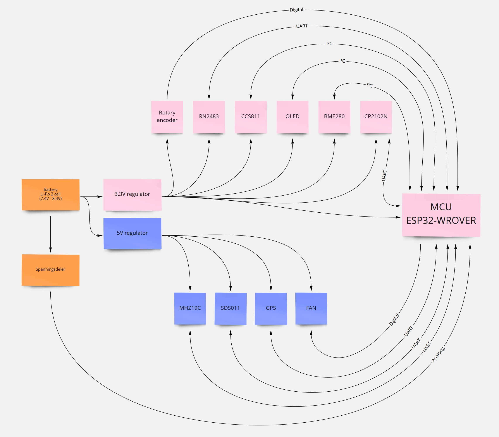
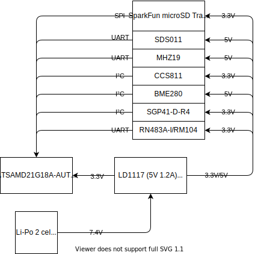
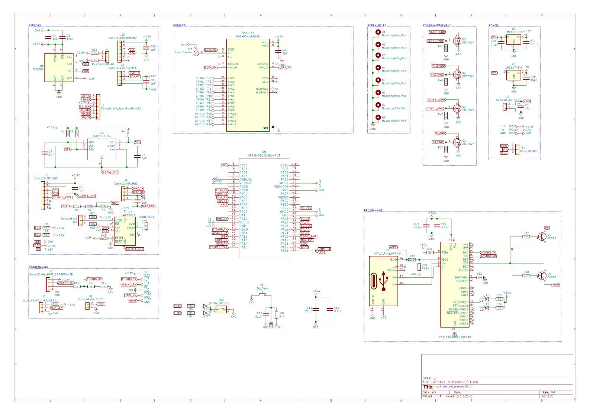
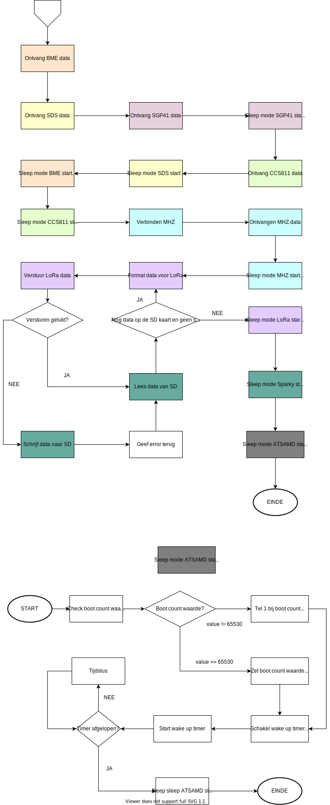
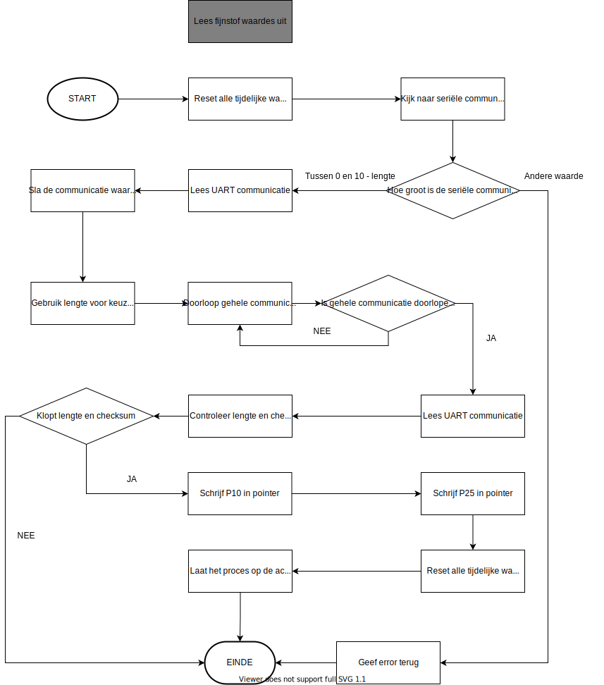
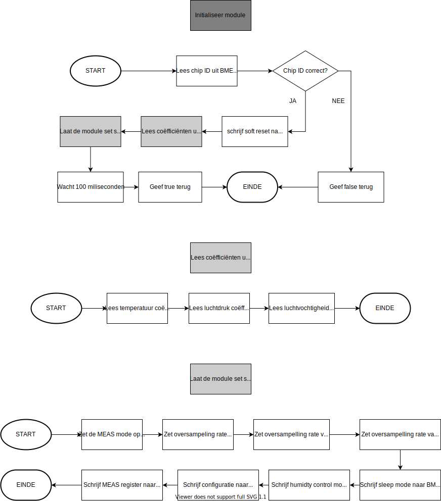
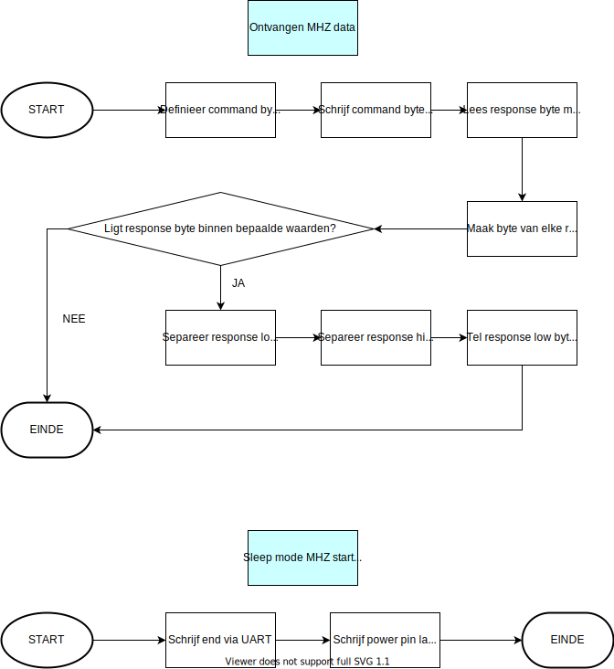
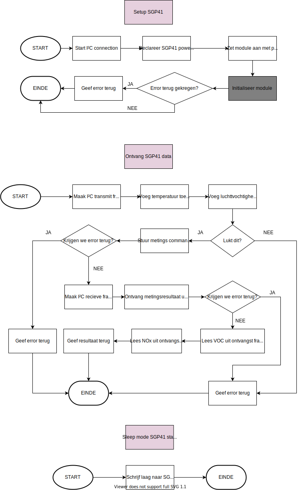

<h1>Blueprint Luchtkwaliteitssensor</h1>

<h2>AP Hogeschool Antwerpen</h2>

<h3>Gemaakt voor de haven van Antwerpen</h3>

<div style="display: flex;">
    <div style="flex:50%;">
        <p>
Begeleiders:
        </p>
        <h4>
            Maarten Luyts
        </h4>
        <h4>
            Patrick Van Houtven
        </h4>
    </div>
    <div style="flex:50%;text-align:right">
        <p>
            Gemaakt door:
        </p>
        <h4>
            Daan Dekoning Krekels
        </h4>
        <h4>
            Olivier Van Ransbeeck
        </h4>
        <p>
            2ITIOT<br>
            Academiejaar 2021-2022
        </p>
    </div>
</div>

<div style="page-break-after: always; break-after: page;"></div>

<h2>Inhoudstafel</h2

[TOC]

<div style="page-break-after: always; break-after: page;"></div>

# Versiebeheer

| Nr.  | Datum      | Verspreiding            | Status           | Wijziging                                                                     |
| ---- | ---------- | ----------------------- | ---------------- | ----------------------------------------------------------------------------- |
| 0.01 | 09/12/2021 | Mr. Patrick Van Houtven | Eerste verdeling | Alle toevoegingen, bezig aan Functioneel en Technisch Design                  |
| 0.02 | 19/12/2021 | Mr. Patrick Van Houtven | Tweede verdeling | Feedback nr0.01 toegepast, bezig aan Planning, Infrastructuur en Documentatie |


# Termen en Afkortingen

| Term            | Omschrijving                                                 |
| --------------- | ------------------------------------------------------------ |
| PoA             | Port of Antwerp; Haven van Antwerpen                         |
| MCU             | Microcontroller                                              |
| eCO<sub>2</sub> | CO<sub>2</sub>-eq koolstofdioxide equivalent om het gas te kunnen vergelijken met ander ebroeikasgassen, de omrekening is gebaseerd op het Global Warming Potential (GWP). <sup>[2]</sup> |
| eTVOC           | Total concentration of Volatile Organic Compounds equivalent. De equivalente waarde van organische materialen in de lucht. |
| NO<sub>X</sub>  | Stikstofoxiden: de som van stikstofmonoxide (NO) en stikstofdioxide (NO<sub>2</sub>). <sup>[3]</sup> |
| I/O             | Input/Output: de ingangen en uitgangen van bijvoorbeeld een MCU. |
| I²C             | Met de I2C-bus u kunt veel apparaten van derden, die dit type protocol hebben, aansluiten en gebruiken om met verschillende componenten te communiceren. <sup>[4]</sup> |
| OLED            | Oleds zijn het bekendst van kleine beeldschermen en displays en vormen daarmee een concurrent voor de traditionele lcd-schermen. Oleddisplays hebben het bijkomende voordeel zonder achtergrondverlichting (backlight) te kunnen, wat gunstig is voor het stroomverbruik van met name draagbare apparaten. Doordat het oledmateriaal zelf licht uitzendt is ook de kijkhoek veel groter en kunnen de beeldschermen ook bij grote formaten zeer dun worden uitgevoerd. <sup>[5]</sup> |
| LCD             | Een plat beeldscherm met een laag energieverbruik. Hierdoor zijn lcd’s bij uitstek geschikt om te gebruiken in platte elektronische apparatuur of in draagbare apparaten die een batterij met beperkte capaciteit hebben. <sup>[6]</sup> |

| Term            | Omschrijving                                                 |
| --------------- | ------------------------------------------------------------ |
| LoRaWAN         | Is een specificatie voor een telecommunicatienetwerk geschikt voor langeafstandscommunicatie met weinig vermogen. <sup>[7]</sup> |
| ASCII           | Is een standaard 7-bits-tekencodering om Latijnse letters, cijfers, leestekens en enkele andere tekens en stuurcodes te representeren en aan ieder teken in die reeks een geheel getal te koppelen, waarmee dat teken kan worden aangeduid. <sup>[8]</sup> |
| UART            | Is een hardwarecomponent gebruikt voor asynchrone, seriële communicatie met andere elektronische systemen. <sup>[9]</sup> |
| IC              | Is een samenstel van verschillende elektronische componenten (zoals transistors, weerstanden en condensatoren) op een enkel stuk halfgeleidermateriaal. <sup>[10]</sup> |
| SMD             | In tegenstelling tot een component met aansluitdraden wordt een SMD-onderdeel niet gemonteerd met behulp van draadverbindingen door de printplaat heen, maar aan één zijde tegen de printplaat aan gesoldeerd. <sup>[11]</sup> |
| PCB             | Is een plaat van isolatiemateriaal die dient als drager voor elektronische componenten, waarop koperen bedradingen, genaamd sporen, zijn aangebracht ter verbinding van die componenten. <sup>[12]</sup> |
| ppm             | Aantal deeltjes per miljoen                                  |
| ppb             | Aantal deeltjes per miljard                                  |
| UI              | Is de interface (intermediair) tussen een computer (of andere machine) en de mens die de computer gebruikt. De gebruikersinterface maakt interactie tussen mens en machine mogelijk.<sup>[13]</sup> |
| Epic            | Is een taak die te groot is om in één keer op te pakken en af te leveren. Epics kunnen opgedeeld worden in User Stories die dan op de Product Backlog kunnen worden geplaatst.<sup>[14]</sup> |
| Breadboard      | Is een bordje, vaak van wit of geel plastic of pertinax, dat gebruikt wordt om elektrische schakelingen tijdelijk op te bouwen. <sup>[15]</sup> |
| Case            | Het punt van een 3D geprinte case is om uw elektronische schakelingen van de weersomstandigheden te kunnen schuilen. |
| SPI             | Is een synchrone seriële datalink tussen ten minste twee mediums. <sup>[16]</sup> |
| Bootloader      | Is een computerprogramma dat zorgt voor het starten van het besturingssysteem bij de opstart (bootstrap) van een computer. <sup>[17]</sup> |
| Programmer      | Is een stuk hardware dat je toelaat om je programma naar een MCU te schrijven. |

<div style="page-break-after: always; break-after: page;"></div>

# Opdrachtgever

Er is een als maar groeiende vraag naar data in verband met onze luchtkwaliteit. Ook de Port of Antwerp ziet hier potentieel in en daarom verlangt ze ernaar om de luchtkwaliteit van de volledige haven in kaart te brengen.  Dit zal gedaan worden door op een tiental locaties sensoren op te hangen. Via LoRaWAN zullen deze verschillende sensoren op een zuinige en veilige manier hun sensordata kunnen doorgeven. 

# Samenvatting

Het vorige project had als doel om met een module de luchtkwaliteit in de straten van Antwerpen te meten. Zij hadden verschillende sensoren gebruikt waarmee zij diverse luchtkwaliteitsparameters opslaan, verwerken en analyseren.

Dit project zal de efficiëntie, gebruiksvriendelijkheid en dataverwerkingscapaciteit verbeteren van de module om op deze manier de huidige tekortkomingen weg te werken. 

Deze tekortkomingen kunnen als volgt voorgesteld worden:

- De hitte ontwikkeling in de module leidt tot foutieve temperatuurmetingen.

- De huidige module is alleen capabel tot korte afstandscommunicatie via wifi of door gebruik te maken van een SD-kaart.

- De maximale batterijduur bedraagt momenteel minder dan 1 maand.

Buiten deze tekortkomingen kunnen volgende functionaliteiten nog toegevoegd of verwijderd worden:

- Het verminderen van het aantal onnodige temperatuurmeettoestellen.

- Het verwijderen van het OLED scherm om batterijduur te verhogen.

- Het verwijderen van de GPS aangezien dit statische apparaten zijn op vaste locaties.

- Het veranderen van de huidige MCU naar een energiezuiniger model.

- Het verminderen van het aantal software bibliotheken om de opslagcapaciteit te verhogen.

- Het voorstellen van de data op een gebruiksvriendelijke interface.

# Probleemstelling

De haven van Antwerpen vindt dat de sensor langdurig op batterij moet kunnen werken. Dit omdat de sensoren op locaties zullen hangen waar er geen stroomvoorziening voor handen is. Voorts is er een vraag gekomen om NO<sub>X</sub> te meten in de lucht om zo te kunnen onderzoeken of er schadelijke stoffen aanwezig zijn. 

Tenslotte is er de vereiste gekomen om de data op een andere manier te communiceren. In plaats van de huidige manier van het manueel vergaren van de data via een SD kaart moet deze draadloos doorgestuurd kunnen worden. Wi-Fi of Bluetooth zal niet beschikbaar op de locatie van de sensoren.

<div style="page-break-after: always; break-after: page;"></div>

# Situatie As-Is

Momenteel is het project al redelijk ver gevorderd<sup>[1]</sup>. Het vorige doel was om een mobiele sensor te maken zodat de studenten van chemie er metingen mee kunnen uitvoeren in en rondom Antwerpen. De module moet voor een langere tijd mobiel kunnen werken, zijn positie weergeven op een kaart en in verbinding staan met een databank. De sensor moest beschikken over een communicatietechniek die weinig stroom verbruikt en een groot bereik heeft. De eerste prototypes zijn al afgeleverd en lijken te werken.

In figuur 1 is de mindmap van de huidige staat van de sensor te zien. Je kan zien dat de hardware en software vereisten al zijn ingevuld. De basis zal tijdens dit project grotendeels hetzelfde zijn. 

<figure>

<figcaption >Figuur 1: Mindmap</figcaption>
</figure>

Vervolgens is er het huidig hardware schema. Hierin is uitgebreid weergegeven hoe de verschillende sensoren en componenten van de juiste spanning worden voorzien en hoe ze momenteel communiceren met de ESP32 module. 

<figure>

<figcaption >Figuur 2: Hardware schema</figcaption>
</figure>

Er was destijds gekozen voor een ESP32-WROVER omdat deze beschikte over genoeg opslag en I/O aansluitingen. Ondanks dat deze MCU meer stroom verbruikt werd hij toch in plaats van de ATSAMD21G18A-AUT, die bekend staat voor zijn low-power eigenschappen, gekozen. Dit komt omdat de ESP32 beter ondersteund wordt dan de ATSAMD. De implementatie van de ATSAMD ging moeizaam en werd daarom uiteindelijk in die fase van het project niet gebruikt. 

Wel is er bij de keuze van modules en sensoren wel rekening gehouden met met stroomverbruik. De huidige sensoren en modules zijn in onderstaande tabel terug te vinden. 

| Naam                                             | Argumentatie                                                                                                                                                                                                                                                                                                                                                                                                   |
| ------------------------------------------------ | -------------------------------------------------------------------------------------------------------------------------------------------------------------------------------------------------------------------------------------------------------------------------------------------------------------------------------------------------------------------------------------------------------------- |
| GY-NEO6MV2                                       | De GPS module GY-NEO6MV2 is een zeer snelle, kleine en  compacte module om de locatie te bepalen. Het is makkelijk implementeerbaar en makkelijk te coderen.                                                                                                                                                                                                                                                   |
| 0.96 inch OLED Display 128*64 pixels blauw - I2C | Een OLED display is populair om zijn compactheid en  scherpheid. Het is ondersteund door elke MCU en maakt gebruik van de 2  meest voorkomende spanningsniveaus (3.3V en 5V). Om pinnen te besparen, is het makkelijk dat de OLED kan aangestuurd worden via I²C. Daarnaast is de grootte en plaats van de letters & tekens is  vrij te kiezen. Deze   functionaliteit is er niet bij een LCD.                 |
| RN2483A-I/RM104                                  | LoRa staat bekend om zijn low-power functionaliteiten en  zeer lange afstanden (10km en langer). Daarom wordt deze module gebruikt om de data van al de sensoren naar de server te krijgen. Daarnaast is deze module simpel aan te sturen dankzij de ASCII  commando's via UART interface en ook bruikbaar bij 5V IC's zoals Arduino Nano en Uno.                                                              |
| CCS811                                           | Een minder bekende sensor maar zeker wel bekend in IoT toepassingen. Het kan temperatuur, eCO² en eTVOC meten. Het heeft geen  opwarm tijd dus is direct bruikbaar en is ook een SMD component wat  zeker een voordeel is om het zo compact mogelijk te maken.                                                                                                                                                 |
| SDS011                                           | De SDS011 is een veel gebruikte fijnstof sensor voor  DIY-projecten. Het zal niet de nauwkeurigste zijn, maar het geeft toch  al een sterke indicatie van wat het fijnstof gehalte is in de lucht.  Daarnaast is het een goedkoop model. Het werkt met een ventilator die de lucht binnentrekt. Het zal  dus eerst moeten opgezet worden om de huidige lucht erin te trekken  vooraleer er gemeten kan worden. |
| BME280                                           | Deze IC heeft een tal van metingen aan boord (temperatuur,  luchtvochtigheid en druk) en het is een SMD component, dus makkelijk  te integreren op een PCB.                                                                                                                                                                                                                                                    |
| MHZ19                                            | Het is een sensor dat enkel en alleen is ontworpen om CO² te meten. Het zal dus zeer nauwkeurig zijn. Enkel heeft het een opwarmtijd nodig.                                                                                                                                                                                                                                                                    |

Momenteel worden volgende metingen gedaan: temperatuur, CO², eCO², eTVOC, fijnstof, luchtdruk, luchtvochtigheid. Echter zijn nog niet alle metingen accuraat genoeg, zo meet de temperatuursensor te hoge waardes omdat de microcontroller warmte ontwikkelt. Het toestel beschikt over een GPS module en een OLED scherm.

<div style="page-break-after: always; break-after: page;"></div>

# Situatie To-Be

De functionele vereisten van de luchtkwaliteitssensor zijn sinds dit jaar aangepast. Daarom zullen er ook een aantal aspecten van de sensor moeten veranderen. 

Terwijl er vorig jaar de noodzaak was om een mobiele sensor te hebben die in en rond Antwerpen de luchtkwaliteit kon meten, is dit nu niet meer het geval. De sensoren zullen een vaste plaats krijgen en daar voor een lange periode op batterij moeten werken. 

Daarom zal de GPS module verwijderd worden aangezien het niet nodig is om live locatie informatie te krijgen. Dit zal voordelen opleveren op vlak van een verminderd stroomgebruik. 

Voorts is het OLED display niet meer noodzakelijk door de draadloze communicatie dus zal ook die component verwijderd worden. Ook hierbij zal er een verminderd stroomverbruik zijn. 

Hiernaast is er de eis gekomen om stikstofoxiden te meten. Hiervoor zal er een interne sensor voorzien worden die in de huidige architectuur zal passen. 

De communicatie via LoRaWAN is tot op heden ook nog steeds een vereiste. 

Tenslotte zal er de overstap gemaakt worden naar de ATSAMD21G18A-AUT als microcontroller omdat deze een zeer laag stroomverbruik heeft. Zoals eerder gezegd heeft die wel als nadeel dat het gebruik van deze MCU ingewikkelder is in vergelijking met de ESP32 die meer ondersteuning heeft.

Onderstaande figuur toont een mindmap van de huidige staat waarop de veranderingen die zullen gebeuren te vinden zijn. De grijze ballonnen zijn de componenten die weggelaten worden en groene ballonnen degene die toegevoegd worden.

<figure>

<figcaption >Figuur 3: Mindmap van te maken aanpassingen</figcaption>
</figure>

## Projectdefinitie

### Doelstelling

De doelstelling van het project is om de bestaande luchtkwaliteitssensor uit te breiden en te verbeteren waardoor het de luchtkwaliteit kan opmeten in de haven van Antwerpen voor een lange periode. 

Vervolgens zal deze data op een intuïtieve manier voorgesteld worden op een online dashboard die de bevoegde personen kunnen bekijken. 

Hierdoor kunnen zij tot nieuwe inzichten komen om de de luchtkwaliteit te verbeteren.

### Scope

#### Vereiste functionaliteiten luchtkwaliteitssensor

- Het op interval doorsturen van metingen naar een server via LoRaWAN.

- Een batterijduur van meer dan 1 maand.

- Externe temperatuur meten (-15°C tot 50°C).

- Externe CO² waardes meten (0-5000ppm).

- Externe TVOC waardes meten (0-1000ppb).

- Externe fijnstof waardes meten (0-999.9 µgram/m²).

- Externe luchtdruk waardes meten (900-1087hPA).

- Externe luchtvochtigheid waardes meten (0-100RH%).

- Externe stikstofoxiden waardes meten (150-300ppb).

- Het intern batterij voltage weergeven.

- De capaciteit hebben om terug te vallen op SD-opslag bij mislukte verzending via LoRa.

- Het lezen van waardes via de seriële monitor voor test doeleinden.

#### Vereiste functionaliteiten monitoring dashboard

- Gegevens van de server omzetten in grafieken

- Het weergeven van grafieken op een internet dashboard.

- De positie weergeven van de sensor op een kaart op het dashboard (zonder live data van de locatie).

### Niet in Scope

#### Een zelf ontwikkeld dashboard

De LORAPayload gaat door Node-RED in een database geplaatst worden. De database wordt InfluxDB. Vanuit deze data gaat Grafana de gegevens ophalen om de visualisaties te doen. Het dashboard zal qua design dus niet binnenshuis ontwikkeld worden.

#### LoRaWAN infrastructuur opzetten

De LoRaWAN van de haven zal gebruikt worden om de data te communiceren naar de server. Het opzetten en onderhouden van de LoRaWAN infrastructuur ligt niet binnen de scope.

#### Onderhoud en updates vanaf 2023

Vanaf 2023 zal het onderhoud en de updates van zowel het dashboard als de luchtkwaliteitssensor niet meer gewaarborgd worden.

### Minimum Viable Product

Een stationaire sensor met behuizing voor buiten gebruik waarin onderstaande metingen gebeuren:

- Omgevingstemperatuur

- Luchtvochtigheid

- Luchtdruk

- CO²/eCO²

- TVOC/eTVOC

- Fijnstof

- Stikstofoxiden

Deze metingen worden via LoRaWAN van de Antwerpse haven opgestuurd en weergegeven op een UI.

# Planning

Er zal een kaban board in GitKraken gebruikt worden om de planning bij te houden. Dit board is ook gesynchroniseerd met "GitHub issues" waardoor men een beter overzicht zal krijgen van de afgewerkte en nog af te werken onderdelen.

In het kaban board zijn de mogelijke statussen van de individuele delen zichtbaar als kolommen om elk deel apart te kunnen opvolgen.  De mogelijkheden zijn de volgende:

- To do

- In progress

- Review in progress

- Review approved

- Done

Tijdens het project worden er 2 fases gehanteerd voor het maken van updates: de pré-review en de review fase. De eerste 2 statussen (To do en In progress) worden door het team aan elk onderdeel toegekend tijdens de pré-review fase. Hierna wordt de controle van dat deel over gegeven aan de begeleiders tijdens de Review fase. Zij zullen deze updates vervolgens beoordelen en feedback terugsturen waarop er terug aanpassingen zullen gemaakt worden.

De methodologie die voor het project zal gebruikt worden is agile. Er zullen constant nieuwe updates uitgevoerd worden om elke module van de luchtkwaliteitssensor efficiënter en beter te maken. 

<figure>

<figcaption >Figuur 4: Kaban Dashboard</figcaption>
</figure>

## Hoofdlijnen

De planning werkt met wekelijkse of 2-wekelijkse deadlines. 

Zoals reeds gezegd wordt de planning door het kaban board in GitKraken bijgehouden. Onder "Detailplanning" kan u het volledige tijdsschema terugvinden.

## Epics

Bij dit project zal met agile gewerkt worden. Hieronder volgt een korte beschrijving van de verschillende epics waarin het project zal onderverdeeld zijn.

#### Componenten onderzoeken, testen en documenteren

Bij elk individuele component zal er afzonderlijk onderzocht moeten worden op welke manier deze te integreren valt. Dat wil zeggen dat de features van deze component getest zullen worden en vervolgens de code en schakeling ervoor ontwikkelt zal worden om deze te implementeren in het project. Vervolgens moet er uitvoerig getest worden om de correcte werking te garanderen. Tenslotte zal de implementatie ervan gedocumenteerd worden.

#### Componenten toevoegen aan het project

Nadat de component getest is en correct bevonden is, moet deze geïmplementeerd worden in het project. Dit is natuurlijk een wederkerend proces voor elke nieuwe component. De samenwerking van de componenten wordt bekeken en voorkomende problemen zullen opgelost worden. Dit wordt hoogstwaarschijnlijk gedaan op een breadboard.

#### PCB ontwikkelen

Pas wanneer, bij de vorige stap, het gehele project aan de eisen voldoet, zal er een PCB gemaakt worden van de huidige staat van het project. Opnieuw zullen er verschillende testen plaats vinden om een correcte werking ervan te garanderen. De PCB's zullen dan besteld worden wat redelijk wat tijd in beslag zal nemen.

#### UI software onderzoeken en testen

Nadat er zekerheid is dat alle componenten correct werken, zal de User Interface ontwikkeld worden die de gemeten waardes van de sensoren op een visuele manier kan voorstellen. Deze wordt aangepast wanneer er nieuwe componenten toegevoegd worden aan het project.

#### Ontwikkeling case

De case is een zeer belangrijk deel van het project omdat het de integriteit van de schakeling waarborgt. Bij elke nieuwe PCB moet er gekeken worden of de huidige case nog voldoet aan de vereisten en zo niet moet deze opnieuw geüpdatet en geprint worden.

#### Live testen project

Tenslotte zal het project meerdere keren in de haven van Antwerpen worden uitgetest om te zien of de werking correct is.

## Detailplanning

In onderstaande figuur zijn de opgelegde milestones te zien. De deadlines van de milestones met het meeste prioriteit staan logischerwijs als eerste.  

| Milestone                | Deadline      | Uitleg                                                       |
| :----------------------- | ------------- | ------------------------------------------------------------ |
| Overschakeling op ATSAMD | 6 maart 2022  | Alle huidige geïmplementeerde componenten moeten werken met de ATSAMD. |
| Integrering NOx sensor   | 31 maart 2022 | De NOx sensor moet volledig werkende zijn.                   |
| Prototype V0.1           | 13 mei 2022   | NOx sensor, ATSMAD, new case, database, GUI.                 |
| GUI Integratie           | 31 mei 2022   | De volledige integratie van de GUI met database.             |
| SD fallback integratie   | 20 mei 2022   | Metingen tijdelijk opslaan op SD kaart als LoRaWAN niet beschikbaar is. |
| Release V1               | 30 mei 2022   | Volledige release van project.                               |

<figure>

<figcaption >Figuur 5: Kaban Timeline</figcaption>
</figure>

Aan iedere milestone zullen verschillende issues gelinkt worden zodat, als de issues gesloten worden, we automatisch kunnen zien hoe ver iedere milestone gevorderd is. De milestones zullen nog geüpdatet worden, moesten er gaandeweg wijzigingen gebeuren. 


# Functioneel design

In onderstaande diagram is de abstracte architectuur van het toekomstige ontwerp te zien. Deze diagram toont de luchtkwaliteitssensor als draadloos apparaat dat verbonden is met een gateway of toegangspunt. Uiteraard is het de bedoeling dat er meerdere verschillende luchtkwaliteitssensoren verbonden zijn met een gateway. 

De gateway geeft de ontvangen informatie door aan de data verwerking, die zal op zijn beurt de informatie verwerken en op de juiste manier de database opslaan. Gebruikers kunnen het dashboard raadplegen met visualisaties van de gebeurde metingen. Het dashboard haalt deze gegevens rechtstreeks uit de database. 

<figure>

<figcaption >Figuur 6: Abstracte Architectuur</figcaption>
</figure>

<div style="page-break-after: always; break-after: page;"></div>

# Technisch design

## Smart Object (Hardware Analyse)

### Samenvatting componenten

- CCS81: Temperatuur, eCO2 en TVOC

- SDS011: Fijnstof

- BME280: Temperatuur, luchtdruk en luchtvochtigheid

- Batterij: Voltage

- MHZ19: CO²

- RN483A-I/RM104: LoRa

- SGP41-D-R4: NOx

- ATSAMD21G18A-AUT: MCU

- SparkFun microSD Transflash breakout: SD-kaart

### Blokdiagram

De data van de MCU wordt verstuurd via 3 protocollen: UART, I²C en SPI.
Aangezien verschillende modules met dezelfde aansluitingen verbonden zijn, zal elke module een ander adres krijgen om te zorgen dat de data de juiste module bereikt.

De batterij levert een voltage van 7.4V aan. Dat is natuurlijk te hoog voor de gebruikte componenten waardoor er 2 lineaire serie regelaars nodig zijn om het voltage te verlagen. Het verlaagt de 7.4V naar zowel 5V als 3.3V. Vervolgens worden de verschillende voltages naar de juiste modules uitgestuurd.

<figure>

<figcaption >Figuur 7: Blokdiagram</figcaption>
</figure>

### Specificaties

| **Blok**                                 | **Specificatie**    | **Min** | **Nominaal** | **Max**          |
| ---------------------------------------- | ------------------- | ------- | ------------ | ---------------- |
| **ATSAMD21G18A-AUT**                     | Werkspanning        | 1.62V   | 3.3V         | 3.8V             |
|                                          | Frequentie CPU      | -       | 48mHz        | -                |
|                                          | Stroomverbruik      | 1.17mA  | 3.37mA       | 6.32mA           |
|                                          | Stroomlimiet        | -       | -            | 92mA             |
| **RN2483A-I/RM104**                      | Werkspanning        | 2.1V    | 3.3V         | 3.6V             |
|                                          | Stroomverbruik      | 1.6µA   | 2.8mA        | 38.9mA           |
|                                          | Stroomlimiet        | -       | -            | 200mA (25mA/pin) |
| **Li-Po 2 Cell**                         | Totale werkspanning | 6.0V    | 7.4V         | 8.2V             |
|                                          | Capaciteit          | -       | 2400mAh      | -                |
| **LD1117**                               | Werkspanning        | 1.2V    | -            | 15V              |
| **CCS811**                               | Werkspanning        | 1.8V    | 3.3V         | 3.3V             |
|                                          | Stroomverbruik      | 19µA    | 26mA         | -                |
|                                          | Stroomlimiet        | -       | -            | 54mA             |
| **SDS011**                               | Werkspanning        | 4.7V    | 5V           | 5.3V             |
|                                          | Stroomverbruik      | <4mA    | 70mA         | 80mA             |
|                                          | Stroomlimiet        | -       | -            | 200mA            |
| **BME280**                               | Werkspanning        | 1.7V    | 3.3V         | 3.6V             |
|                                          | Stroomverbruik      | 0.1µA   | 3.6µA        | 630µA            |
|                                          | Stroomlimiet        | -       | -            | 4.5mA            |
| **MH-Z19**                               | Werkspanning        | 4.9V    | 5V           | 5.5V             |
|                                          | Stroomverbruik      | -       | <18mA        | -                |
|                                          | Stroomlimiet        | -       | -            | 125mA            |
| **SparkFun microSD Transflash breakout** | Werkspanning        | 2.8V    | 3.3V         | 3.6V             |
| **SGP41-D-R4**                           | Werkspanning        | 1.7V    | 3.3V         | 3.6V             |
|                                          | Stroomverbruik      | 34µA    | 3.2mA        | 4.6mA            |
|                                          | Stroomlimiet        | -       | -            | 100mA            |

### Onderliggende argumentatie

| **Blok**          | Component                            | **Argumentatie**                                                                                                                                                                                                                                                          | Links                                                                                                                                                                                                                                                                                                                                                                                                                                                                                                                                                                                                                                                           | **Alternatieven**                               |
| ----------------- | ------------------------------------ | ------------------------------------------------------------------------------------------------------------------------------------------------------------------------------------------------------------------------------------------------------------------------- | --------------------------------------------------------------------------------------------------------------------------------------------------------------------------------------------------------------------------------------------------------------------------------------------------------------------------------------------------------------------------------------------------------------------------------------------------------------------------------------------------------------------------------------------------------------------------------------------------------------------------------------------------------------- | ----------------------------------------------- |
| CPU               | ATSAMD21G18A-AUT                     | De grootste troef van de ATSAMD21 is dat het een zeer zuinige chip is. De ATSAMD21 verbruikt maximaal 6.32mA, de ESP32 daarentegen kan tot wel 500mA verbruiken. De MCU is krachtig en heeft zeer veel I/O pinnen. De bootloader moeten initieel zelf nog gebrand worden. | [Winkel](https://www.mouser.be/ProductDetail/Microchip-Technology-Atmel/ATSAMD21G18A-AUT?qs=KLFHFgXTQiBkLYobE%2Fq9Qw==&gclid=CjwKCAiAh_GNBhAHEiwAjOh3ZHG8WOdRiM5K4oojQNa1EaOKMm-MsoXjzRuqgLk8DAMAHz1NB0ujaBoCesEQAvD_BwE)<br>[Datasheet](https://www.mouser.be/datasheet/2/268/SAM_D21_DA1_Family_Data_Sheet_DS40001882H-2580554.pdf)                                                                                                                                                                                                                                                                                                                           | ESP32 WROVER                                    |
| Batterij          | Li-Po 2 Cell                         | De Li-Po batterij heeft een goede capaciteit en zeer lange levensspan. Voorts is haar relatief gewicht laag t.o.v. haar volume. Ze is veel flexibeler dan een lithium-ion batterij.                                                                                       | [Winkel](https://www.conrad.be/p/conrad-energy-lipo-accupack-74-v-2400-mah-aantal-cellen-2-20-c-softcase-xt60-1344133?WT.srch=1&gclid=CjwKCAiAh_GNBhAHEiwAjOh3ZODyQpj1PCOdHiGXfnYxeG0l__VZOiLFqiP5MSZwps0pyi__jmN_WhoC9LsQAvD_BwE&gclsrc=aw.ds&insert=8J&t=1&tid=13894944235_122657379817_pla-301443522443_pla-1344133&utm_campaign=shopping-feed&utm_content=free-google-shopping-clicks&utm_medium=surfaces&utm_source=google&utm_term=1344133&vat=true)<br/>[Datasheet](https://asset.conrad.com/media10/add/160267/c1/-/en/001344133SD01/veiligheidsvoorschriften-1344133-conrad-energy-lipo-accupack-74-v-2400-mah-aantal-cellen-2-20-c-softcase-xt60.pdf) | Lithium-ion batterij                            |
| Voltage converter | LD1117                               | De LD1117 heeft het exacte bereik dat nodig is. De spanning van de 7.4V batterij zal naar 3.3V en 5V geconverteerd worden.                                                                                                                                                | [Winkel](https://www.conrad.be/p/stmicroelectronics-ld1117av33-spanningsregelaar-lineair-to-220ab-positief-vast-1-a-1184973?searchTerm=LD1117&searchType=suggest&searchSuggest=product)<br/>[Datasheet](https://asset.conrad.com/media10/add/160267/c1/-/en/001184973DS01/datablad-1184973-stmicroelectronics-ld1117av33-spanningsregelaar-lineair-to-220ab-positief-vast-1-a.pdf)                                                                                                                                                                                                                                                                              | MIC5219-3.3YM5-TR, MIC5219-5.0YM5-TR            |
| MicroSD-Lezer     | SparkFun microSD Transflash breakout | Er is gekozen voor de SparkFun kaartlezen omdat deze zeker beschikbaar is. Deze module is zeer klein dus dat komt goed van pas.                                                                                                                                           | [Winkel](https://www.sparkfun.com/products/544)<br/>[Datasheet](https://www.sparkfun.com/datasheets/Prototyping/microSD_Socket.pdf)<br/>[Bibliotheek](https://github.com/arduino-libraries/SD)                                                                                                                                                                                                                                                                                                                                                                                                                                                                  | Eender welke Arduino compatibele microSD-Lezer. |
| Temperatuur       | BME280                               | Deze sensor is een bekende en goed ondersteunde sensor die makkelijk op de PCB te integreren is. Ze heeft verschillende metingen aan boord waardoor het een kost-effectieve IC is. Het bereik is perfect voor de temperaturen in België.                                  | [Winkel](https://www.tinytronics.nl/shop/nl/sensoren/temperatuur-lucht-vochtigheid/bme280-digitale-barometer-druk-en-vochtigheid-sensor-module)<br/>[Datasheet](https://www.mouser.com/datasheet/2/783/BST-BME280_DS001-11-844833.pdf)<br/>[Bibliotheek](https://github.com/adafruit/Adafruit_BME280_Library)                                                                                                                                                                                                                                                                                                                                                   | LM35, DHT22                                     |
| Luchtdruk         | BME280                               | Deze sensor is een bekende en goed ondersteunde sensor die makkelijk op de PCB te integreren is. Ze heeft verschillende metingen aan boord waardoor het een kost-effectieve IC is.                                                                                        | [Winkel](https://www.tinytronics.nl/shop/nl/sensoren/temperatuur-lucht-vochtigheid/bme280-digitale-barometer-druk-en-vochtigheid-sensor-module)<br/>[Datasheet](https://www.mouser.com/datasheet/2/783/BST-BME280_DS001-11-844833.pdf)<br/>[Bibliotheek](https://github.com/adafruit/Adafruit_BME280_Library)                                                                                                                                                                                                                                                                                                                                                   | MPX4115A                                        |
| Luchtvochtigheid  | BME280                               | Deze sensor is een bekende en goed ondersteunde sensor die makkelijk op de PCB te integreren is. Ze heeft verschillende metingen aan boord waardoor het een kost-effectieve IC is.                                                                                        | [Winkel](https://www.tinytronics.nl/shop/nl/sensoren/temperatuur-lucht-vochtigheid/bme280-digitale-barometer-druk-en-vochtigheid-sensor-module)<br/>[Datasheet](https://www.mouser.com/datasheet/2/783/BST-BME280_DS001-11-844833.pdf)<br/>[Bibliotheek](https://github.com/adafruit/Adafruit_BME280_Library)                                                                                                                                                                                                                                                                                                                                                   | DHT22                                           |
| CO²               | MH-Z19                               | De positieve zaken van deze sensor zijn de volgende:  Non-Dispersief InfraRood-licht waardoor ze zeer zuinig is, goede kalibratie out-of-the-box en makkelijk leesbaar uit een seriële poort via UART.                                                                    | [Winkel](https://www.tinytronics.nl/shop/nl/sensoren/winsen-mh-z19c-co2-sensor-met-kabel)<br/>[Datasheet](https://www.winsen-sensor.com/d/files/PDF/Infrared%20Gas%20Sensor/NDIR%20CO2%20SENSOR/MH-Z19%20CO2%20Ver1.0.pdf)<br/>[Bibliotheek](https://github.com/strange-v/MHZ19)                                                                                                                                                                                                                                                                                                                                                                                | MQ-135, Adafruit SGP30                          |

| **Blok**          | Component                            | **Argumentatie**                                                                                                                                                                                                                                                          | Links                                                                                                                                                                                                                                                                                                                                                                                                                                                                                                                                                                                                                                                           | **Alternatieven**                               |
| ----------------- | ------------------------------------ | ------------------------------------------------------------------------------------------------------------------------------------------------------------------------------------------------------------------------------------------------------------------------- | --------------------------------------------------------------------------------------------------------------------------------------------------------------------------------------------------------------------------------------------------------------------------------------------------------------------------------------------------------------------------------------------------------------------------------------------------------------------------------------------------------------------------------------------------------------------------------------------------------------------------------------------------------------- | ----------------------------------------------- |
| eCO²              | CCS811                               | Deze TVOC, eCO² en CO² sensor is heel zuinig waardoor het de batterijduur verbetert. Voorts is het een goede sensor met redelijk accurate waarden.                                                                                                                        | [Winkel](https://www.tinytronics.nl/shop/nl/sensoren/ccs811-luchtkwaliteit-sensor)<br/>[Datasheet](https://www.sciosense.com/wp-content/uploads/documents/SC-001232-DS-2-CCS811B-Datasheet-Revision-2.pdf)<br/>[Bibliotheek](https://github.com/adafruit/Adafruit_CCS811)                                                                                                                                                                                                                                                                                                                                                                                       | Adafruit SGP30                                  |
| TVOC              | CCS811                               | Deze TVOC, eCO² en CO² sensor is heel zuinig waardoor het de batterijduur verbetert. Voorts is het een goede sensor met redelijk accurate waarden.                                                                                                                        | [Winkel](https://www.tinytronics.nl/shop/nl/sensoren/ccs811-luchtkwaliteit-sensor)<br/>[Datasheet](https://www.sciosense.com/wp-content/uploads/documents/SC-001232-DS-2-CCS811B-Datasheet-Revision-2.pdf)<br/>[Bibliotheek](https://github.com/adafruit/Adafruit_CCS811)                                                                                                                                                                                                                                                                                                                                                                                       | Adafruit SGP30                                  |
| Fijnstof          | SDS011                               | De SDS011 is een bekende sensor die gespecialiseerd is in het meten van fijnstof. Ze heeft een goede prijs versus nauwkeurigheid.                                                                                                                                         | [Winkel](https://www.tinytronics.nl/shop/nl/sensoren/nova-sds011-hoge-precisie-laser-stofsensor)<br/>[Datasheet](https://cdn-reichelt.de/documents/datenblatt/X200/SDS011-DATASHEET.pdf)<br/>[Bibliotheek](https://www.arduinolibraries.info/libraries/sds011-sensor-library)                                                                                                                                                                                                                                                                                                                                                                                   | PPD42NS                                         |
| LoRa              | RN2483A-I/RM104                      | Deze module wordt gebruikt om data van de luchtkwaliteitssensor naar de database te sturen over de LoRaWAN infrastructuur van de haven.  De module is redelijk goed ondersteunt en is niet moeilijk om aan te sturen. Ook is ze perfect combineerbaar met de de ATSAMD21. | [Winkel](https://be.farnell.com/microchip/rn2483a-i-rm104/transceiver-module-300kbps-870mhz/dp/2920841)<br/>[Datasheet](https://www.farnell.com/datasheets/2648020.pdf)<br/>[Datasheet-Commands](https://ww1.microchip.com/downloads/en/DeviceDoc/40001784B.pdf)<br/>[Bibliotheek](https://github.com/axelelettronica/sme-RN2483-library)                                                                                                                                                                                                                                                                                                                       | MKL62BA                                         |
| NOx               | SGP41-D-R4                           | De prijskwaliteitsverhouding is zeer goed bij deze sensor die zowel NOx en VOC meet. Gespecialiseerde NOx sensoren zijn zeer duur en zou de projectkosten doen verdubbelen.                                                                                               | [Winkel](https://www.soselectronic.com/products/sensirion/sgp41-sgp41-d-r4-359695)<br/>[Datasheet](https://cdn.sos.sk/productdata/3c/28/3146f64d/sgp41-sgp41-d-r4.pdf)<br/>[Bibliotheek](https://github.com/Sensirion/arduino-i2c-sgp41)                                                                                                                                                                                                                                                                                                                                                                                                                        | Industrial Nitric Oxide (NO) Sensor             |

<div style="page-break-after: always; break-after: page;"></div>

### Elektrisch schema

Onderstaand elektrisch schema is grotendeels gebaseerd op het schema van de huidige toestand van het project. De GPS module is echter weggehaald, het OLED scherm is verwijdert, de NOx sensor SGP41 en de MicroSD lezer is toegevoegd, de ESP32 MCU is vervangen door de ATSAMD21 die gebruikt zal worden.  

Om energie te besparen worden er verschillende componenten uitgeschakeld via een mosfet schakeling. Zo kan de SGP41, MHZ-Z19, CCS811 en de SD kaart uitgeschakeld worden.

Rechts onderaan in het elektrisch schema is de programmer te zien. Omdat de ATSAMD21 enkel maar de chip is, is er een programmer nodig om ons in staat te stellen code naar de MCU te schrijven en een seriële verbinding te starten.

<figure>

<figcaption >Figuur 8: Elektrisch schema</figcaption>
</figure>
<div style="page-break-after: always; break-after: page;"></div>

## Smart Object (Software Analyse)

### Data in / Out

| **Blok**                             | **Data In**                                                                                                                                                                                                             | Data Uit                                                                                                                           |
| ------------------------------------ | ----------------------------------------------------------------------------------------------------------------------------------------------------------------------------------------------------------------------- | ---------------------------------------------------------------------------------------------------------------------------------- |
| ATSAMD21G18A-AUT                     | [LoRa payload, Seed nummer, temperatuur, luchtvochtigheid, druk, TVOC, P10, P25, CO2, NOx, BATVal],  [LoRa payload], BATVal, TVOC, P25, P10, Temperatuur, luchtdruk, luchtvochtigheid, CO², data opgslagen signaal, NOx | Wake-up signalen, sleep signalen, seed aanvraag, data formateer aanvraag, data verstuur aanvraag, connect signalen, setup signalen |
| RN2483A-I/RM104                      | Connect signaal, sleep signaal, data formateer aanvraag, data verstuur aanvraag                                                                                                                                         | [LoRa payload, Seed nummer, temperatuur, luchtvochtigheid, druk, TVOC, P10, P25, CO2, NOx, BATValue] en [LoRa payload]             |
| Li-Po 2 Cell                         | -                                                                                                                                                                                                                       | BATvalue                                                                                                                           |
| LD1117                               | 7.4V                                                                                                                                                                                                                    | 3.3V en 5V                                                                                                                         |
| CCS811                               | Setup signaal, wake-up signaal, sleep signaal, data aanvraag                                                                                                                                                            | TVOC waarde                                                                                                                        |
| SDS011                               | Setup signaal, wake-up signaal, sleep signaal, data aanvraag                                                                                                                                                            | P25 en P10 waarden                                                                                                                 |
| BME280                               | Setup signaal, wake-up signaal, sleep signaal, data aanvraag                                                                                                                                                            | Temperatuur, luchtdruk en luchtvochtigheidswaarden                                                                                 |
| MH-Z19                               | Setup signaal, connect signaal, sleep signaal, data aanvraag                                                                                                                                                            | CO² waarde                                                                                                                         |
| SparkFun microSD Transflash breakout | LoraFormat data, data verstuur signaal                                                                                                                                                                                  | Data opgeslagen signaal                                                                                                            |
| SGP41-D-R4                           | Wake-up Signaal, sleep signaal, data aanvraag                                                                                                                                                                           | NOx waarde                                                                                                                         |

<figure>

</figure>
<figure style="text-align:center">

<figcaption style="text-align:left">Figuur 9: Dataflow Diagram</figcaption>
</figure>


### Flowcharts

#### Legende

Doorheen de flowcharts zijn er verschillende kleuren gebruikt om de verschillende componenten te kunnen scheiden van elkaar. Het hoofdprogramma gebruikt de functies van de verscheidene componenten door elkaar waardoor het met deze legende makkelijker is om een inzicht te krijgen waar de data precies vandaan komt. Ook is dit handig om te bekijken in welke component het programma op elk specifiek moment aan het werk is. 

<figure>

</figure>

#### ATSAMD21G18A-AUT

<figure>

</figure>

<figure>

</figure>

#### RN2483A-I/RM104

<figure>

</figure>

<figure>

</figure>
#### Li-Po 2 Cell

<figure>

</figure>
#### CCS811

<figure>

</figure>

<figure>

</figure>

<figure>

</figure>

#### SDS011

<figure>

</figure>

<figure>

</figure>

#### BME280

<figure>

</figure>

<figure>

</figure>
<div style="page-break-after: always; break-after: page;"></div>

#### MH-Z19

<figure>

</figure>

<figure>

</figure>
<div style="page-break-after: always; break-after: page;"></div>

#### SparkFun microSD Transflash breakout

<figure>

</figure>

<figure>

</figure>
<div style="page-break-after: always; break-after: page;"></div>

#### SGP41-D-R4

<figure>

</figure>

<figure>

</figure>

#### Seed Generator

<figure>

</figure>

<div style="page-break-after: always; break-after: page;"></div>

# Beschrijving van de interfaces

## Samenvatting componenten

- Node-RED: opensource visuele tool voor het verbinden van hardware devices voor IoT.
- InfluxDB: opensource database voor het opslaan van gegevens voor real-time applicaties in IoT.
- Grafana: opensource dashboard voor visueel voorstellen van gegevens in grafieken.

## De componenten in detail

### Node-RED

Node-RED zal gebruikt worden om de payloads die de sensoren doorsturen via LoRaWAN naar het juiste formaat om te zetten en in de database te plaatsen. 

### InfluxDB

InfluxDB is een 'time series database', dat wil zeggen dat InfluxDB speciaal gebouwd is voor het opslaan en teruggeven van gegevens die onderdeel uitmaken van een tijdreeks. Op deze manier kan er gemakkelijk bij iedere meting de tijd worden bijgehouden om achteraf mee op te vragen.

### Grafana

Als dashboard om de meetgegevens van de sensoren weer te geven zal er gebruik worden gemaakt van Grafana. Grafana is een opensource tool voor het analyseren en weergeven van verschillende soorten gegevens. Het is perfect om meetgegevens van alle apparaten te laten samenkomen. De server waar ook de Node-RED en InfluxDB omgeving in draait kan ook Grafana hosten. 

Alle data die het dashboard zal weergeven wordt opgevraagd uit InfluxDB. Er is uitgebreide documentatie beschikbaar over het gebruik van een InfluxDB database met Grafana <sup>[21]</sup>.

Er zijn verschillende soorten grafieken beschikbaar en Grafana is voor de verwachte soort gegevens zeker uitgebreid genoeg. De interface kan uitgetest worden door op de volgende link te klikken: [play.grafana.org](https://play.grafana.org/).

<figure>

<figcaption >Figuur 10: Grafana Dashboard 1</figcaption>
</figure>

<figure>

<figcaption >Figuur 11: Grafana Dashboard 2</figcaption>
</figure>

<figure>

<figcaption >Figuur 12: Grafana Dashboard 3</figcaption>
</figure>

Zoals in figuren 10 tot en met 12 te zien is, zijn veel van de grafieken gebaseerd op informatie die gelinkt is aan een tijdreeks. Dat maakt het heel gemakkelijk om op een bepaalde tijdsschaal het verloop van bijvoorbeeld de gemeten CO2 weer te geven. 

Bij veel grafieken is het ook mogelijk om meerdere reeksen weer te geven in één grafiek. Dat is handig om de metingen van sensoren op verschillende locaties in één oogopslag met elkaar te vergelijken zoals geïllustreerd in figuur 12.

Er zal, zoals figuur 11 weergeeft, per apparaat een apart dashboard beschikbaar zijn zodat er ook voor een enkele locatie metingen kunnen opgevraagd worden. 

Tenslotte zal er ook een kaart worden weergegeven van de locaties van de verschillende sensoren.

<div style="page-break-after: always; break-after: page;"></div>

## De interactie met de UI door de gebruiker

<figure>

<figcaption >Figuur 13: Use Case Situation-to-be</figcaption>
</figure>

# Beschrijving van de datamigratie

Aangezien de data die tot heden verzameld is, tijdens vorige projectfases, geen enkele connectie heeft met de haven van Antwerpen, zal er geen datamigratie aan te pas komen. Deze data zal volledig verwijderd worden voor de implementatie van dit project.

# Beschrijving van de impact op de huidige infrastructuur

De implementatie van het project zal volgende impact hebben:

- Een online database moet aangemaakt worden om data op te slaan.

- Er moet een connectie komen tussen de LoRaWAN gateway en de database.

<div style="page-break-after: always; break-after: page;"></div>

# Analyse van security en autorisatierollen

Beveiliging is uiterst belangrijk, daarom zal hier ook vanaf het begin rekening mee gehouden worden. De sensoren registreren geen privacy gevoelige gegevens maar er moet zeker voor gezorgd worden dat derden niet zomaar toegang kunnen krijgen tot het draadloze netwerk, de database, en het dashboard. De sensoren worden bij voorkeur op een hoogte bevestigd om toegang door derden te bemoeilijken.

Bij LoRaWAN staat beveiliging centraal<sup>[18]</sup>. Dat wil zeggen dat het verplicht is om gebruik te maken van authenticatie en encryptie. Het is dan ook belangrijk dat geheime sleutels beveiligd worden en niet worden hergebruikt worden over de verschillende apparaten. Op de server draait Node-RED, InfluxDB en Grafana. Ook deze diensten zullen goed beveiligd moeten worden. Onze eerste verdedigingslinie zal dan ook het fysiek afschermen van de server zijn. Vervolgens moeten SSH verbindingen geautoriseerd worden via persoonlijke SSH Sleutels. Zo kunnen enkel rechthebbenden aan de terminal interface. 

Strikte firewall regels zullen worden ingesteld. Voor alle andere wachtwoorden zoals die van Node-RED, InfluxBD en Grafana moet er gebruik gemaakt worden van unieke en willekeurig gegenereerde wachtwoorden die best worden bijgehouden in een goed beveiligde password manager. Waar mogelijk zal voor kritische accounts multifactorauthenticatie worden ingeschakeld. 

Een havenmedewerker, zoals omschreven in Figuur 13, kan enkel inloggen op het Grafana dashboard met een gebruikersaccount dat geen rechten heeft om gegevens aan te passen. Iedere medewerker die het dasboard moet kunnen raadplegen zal een persoonlijke login hebben. In Grafana is het mogelijk om voor individuele gebruikers bepaalde rechten in of uit te schakelen<sup>[19]</sup>.

Een administrator moet waar mogelijk gebruik maken van multifactorauthenticatie en kan de database aanpassen, nieuwe sensoren toevoegen en gebruikersaccounts beheren. 

# Documentatie

Documentatie is zeer belangrijk om op een later moment het project verder te kunnen zetten of om het project door te kunnen geven aan een eventueel nieuw team. Er zal van het project een GitHub repository bestaan waarop er documentatie te vinden is. Dit document gaat vooral over de algemene structuur van het project en de individuele componenten waardoor het een zeer goede referentie zal zijn voor de rest van het project. 

Bij aanpassingen aan de infrastructuur zullen de diagrammen mee worden aangepast. Op deze manier is er altijd een duidelijk high-level overzicht van de verschillende componenten. 

Als er een release wordt aangemaakt zal er in de beschrijving worden toegevoegd wat de aanpassingen zijn. Dat zal gebeuren aan de hand van volgende categorieën: `new`, `improved`, `fixed`. Zo is het snel duidelijk wat de aanpassingen zijn in vergelijking met een vorige release.

Bij ingewikkelde stukken code, grote klassen en grote functies zal het nodig zijn om een korte omschrijving te maken van de code. Dit kan door bijvoorbeeld gebruik te maken van gestructureerde docstrings. 

Doxygen<sup>[20]</sup> is een voorbeeld van zo een gestructureerd systeem. Als de docstrings op de juiste wijze worden aangemaakt dan kan Doxygen eventueel zelf documentatie genereren om de werking van functies en klassen toe te lichten. Zie hieronder een voorbeeld van hoe een docstring voor een C++ functie eruit kan zien.

```C++
/**
 * Calculates the Area of the circle.
 * Formula: Area = PI*r^2
 * @param[in] radius
 * @param[out] area
 */ 
float calculate_area(float radius)
{
    float area;
    area = PI * radius * radius;
    return area;
}
```

Een user manual zal niet geschreven worden van het project omdat de interface over het algemeen duidelijk zal zijn. Grafana (het dashboard systeem) heeft voorts een zeer uitgebreide documentatie waar gebruikers terecht kunnen. 

<div style="page-break-after: always; break-after: page;"></div>

# Bronvermelding

| Nummer | APA-brondvermelding                                          |
| ------ | ------------------------------------------------------------ |
| [1]    | Elsermans, R., Kramp, T., & Jongenelen, B. (2021). *AirQualitySensor*. Geraadpleegd op 25 november 2021, van https://ap-it-gh.github.io/ssys21-docs-luchtsensor/#/ |
| [2]    | Centraal Bureau voor de Statistiek. (2020, 6 mei). CO2-equivalent. Geraadpleegd op 3 december 2021, van https://www.cbs.nl/nl-nl/nieuws/2020/19/uitstoot-broeikasgassen-3-procent-lager-in-2019/co2-equivalent |
| [3]    | Het Rijksinstituut voor Volksgezondheid en Milieu. (z.d.). Stikstof - Stikstofoxiden (NOₓ). RIVM. Geraadpleegd op 3 december 2021, van https://www.rivm.nl/stikstof/stikstofoxiden-nox |
| [4]    | I. (2019, 10 december). *Alles over de Arduino I2C-bus*. Hardware libre. Geraadpleegd op 23 december 2021, van https://www.hwlibre.com/nl/i2c-arduino/ |
| [5]    | Wikipedia-bijdragers. (2020, 21 oktober). *Oled*. Wikipedia. Geraadpleegd op 23 december 2021, van https://nl.wikipedia.org/wiki/Oled |
| [6]    | Wikipedia-bijdragers. (2020a, september 10). *Liquid-crystal display*. Wikipedia. Geraadpleegd op 23 december 2021, van https://nl.wikipedia.org/wiki/Liquid-crystal_display |
| [7]    | Wikipedia-bijdragers. (2021, 31 mei). *LoRaWAN*. Wikipedia. Geraadpleegd op 23 december 2021, van https://nl.wikipedia.org/wiki/LoRaWAN |
| [8]    | Wikipedia-bijdragers. (2020a, juni 21). *ASCII (tekenset)*. Wikipedia. Geraadpleegd op 23 december 2021, van https://nl.wikipedia.org/wiki/ASCII_(tekenset) |
| [9]    | Wikipedia-bijdragers. (2020b, juli 24). *UART*. Wikipedia. Geraadpleegd op 23 december 2021, van https://nl.wikipedia.org/wiki/UART |
| [10]   | Wikipedia-bijdragers. (2021b, november 8). *Geïntegreerde schakeling*. Wikipedia. Geraadpleegd op 23 december 2021, van https://nl.wikipedia.org/wiki/Ge%C3%AFntegreerde_schakeling |
| [11]   | Wikipedia-bijdragers. (2021b, juni 29). *Surface-mounted device*. Wikipedia. Geraadpleegd op 23 december 2021, van https://nl.wikipedia.org/wiki/Surface-mounted_device |
| [12]   | Wikipedia-bijdragers. (2021c, oktober 31). *Printplaat*. Wikipedia. Geraadpleegd op 23 december 2021, van https://nl.wikipedia.org/wiki/Printplaat |
| [13]   | Wikipedia-bijdragers. (2021c, augustus 12). *Gebruikersomgeving*. Wikipedia. Geraadpleegd op 23 december 2021, van https://nl.wikipedia.org/wiki/Gebruikersomgeving |

| Nummer | APA-brondvermelding                                          |
| ------ | ------------------------------------------------------------ |
| [14]   | *Wat is een Epic in de Scrum methodologie?* (2020, 25 augustus). Scrumguide. Geraadpleegd op 23 december 2021, van https://scrumguide.nl/epic/ |
| [15]   | Wikipedia-bijdragers. (2020b, juni 26). *Breadboard*. Wikipedia. Geraadpleegd op 23 december 2021, van https://nl.wikipedia.org/wiki/Breadboard |
| [16]   | Wikipedia-bijdragers. (2021c, juli 20). *Serial Peripheral Interface*. Wikipedia. Geraadpleegd op 23 december 2021, van https://nl.wikipedia.org/wiki/Serial_Peripheral_Interface |
| [17]   | Wikipedia-bijdragers. (2021e, augustus 29). *Bootloader*. Wikipedia. Geraadpleegd op 23 december 2021, van https://nl.wikipedia.org/wiki/Bootloader |
| [18]   | LoRa Alliance. (2020, 17 november). LoRaWAN® Is Secure (but Implementation Matters). Geraadpleegd op 17 december 2021, van https://lora-alliance.org/resource_hub/lorawan-is-secure-but-implementation-matters/ |
| [19]   | Grafana Labs. (z.d.). Manage users as a Server Admin. Geraadpleegd op 17 december 2021, van https://grafana.com/docs/grafana/latest/manage-users/server-admin/server-admin-manage-users/ |
| [20]   | Van Heesch, D. (z.d.). Doxygen: Doxygen. Doxygen. Geraadpleegd op 20 december 2021, van https://www.doxygen.nl/index.html |
| [21]   | Grafana Labs. (z.d.). *InfluxDB data source*. Geraadpleegd op 21 december 2021, van https://grafana.com/docs/grafana/latest/datasources/influxdb/ |

